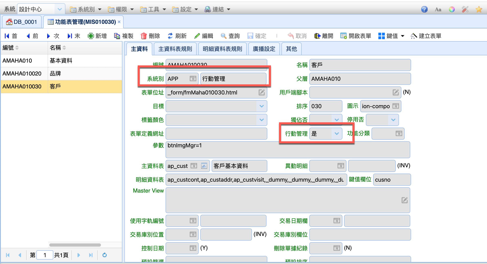

# APP開發

?>
手機前端程式

APP 使用 angularjs 1.x 為開發基礎，開發工具為 ionic＋cordova，可打包為 android 和 ios的安裝包，
開發者須熟悉 html、js。

## 功能表管理

> 系統別：設定為 APP \
> 行動管理: Y \
> 其他：同桌機版設定



## 開發步驟

### 新增 route

> 編輯 js/state.js

```js
{ //amaha010030
    name: "app.amaha010030", //master view
    param: {
      url: "/amaha010030",
      cache: true,
      views: {
        menuContent: {
          templateUrl: '{dataDir}tpl/amaha010030.html',
          controller: 'MasViewCtrl'
        }
      }
    }
  },{
    name: "app.amaha010030-mas", //master edit
    param: {
      url: "/amaha010030-mas/:cusno",
      params: {
        _act: null
      },
      cache: false,
      views: {
        menuContent: {
          templateUrl: '{dataDir}tpl/amaha010030-mas.html',
          controller: 'MasEditCtrl'
        }
      }
    }
  },{
    name: "app.amaha010030-det", //detail view
    param: {
      url: "/amaha010030-det/:cusno",
      cache: true,
      views: {
        menuContent: {
          templateUrl: '{dataDir}tpl/amaha010030-det.html',
          controller: 'DetViewCtrl'
        }
      }
    }
  },{
    name: "app.amaha010030-det-edit", //detail edit
    param: {
      url: "/amaha010030-det-edit/:cusno/:item",
      cache: false,
      views: {
        menuContent: {
          templateUrl: '{dataDir}tpl/amaha010030-det-edit.html',
          controller: 'DetEditCtrl'
        }
      }
    }
  }
```

### 創建 js

> 在 js/ 目錄下 新增 *.js 檔案

```js
function amaha010020(opt) {
  var $scope = opt.$scope;
  var func = {};
  $scope.maskey = 'brandno';
  $scope.detkey = [];
  $scope.masDisFld = ''; //不可編輯
  $scope.masNoModFld = '';
  $scope.detNoModFld = [];
  $scope.detDisFld = []; //[det0, det1]

  /**
   * each view
   */

  if (opt.unit == 'masView') {
    //
  } else if (opt.unit == 'masEdit') {
    //
  } else if (opt.unit == 'detView') {
    //
  } else if (opt.unit == 'detEdit') {
    //
  }

  /**
   * common
   */
  func.handRefer = function (rows) {
    return handRefer(rows);
  }

  for (f in func) {
    opt.$scope[f] = func[f];
  }

  /**
   * hand refer
   */
  function handRefer(rows) {
    var stop = false; stopCnt = 0;
    var stopLoad = function () {
      $interval.cancel(stop);
      stop = undefined;
    }

    stop = $interval(function () {
      if (++stopCnt > 20) stopLoad();
      handData();
    }, 200);

    function handData() {
      if (Object.keys($g.refCache).length > 1) {
        setLocalRefer(rows);
        stopLoad();
      }
    }

    //local refer
    function setLocalRefer(rows) {
      if ($scope.state.detno == 0) { //det1
        //
      } else { //master
        window.setReferEx(rows, 'select_yn', 'top20_y', 'codeno', 'codena');
      }
    }
  }
}
```

### 創建表單

> 在 tpl/ 目錄下 創建表單

#### Master View

```html
<ion-view ng-init="init()">
  <ion-nav-title>
  {{ menu.caption | translate | capitalize }}
  {{ state.totcnt }}
  <!-- ({{ items_length }}) -->
  </ion-nav-title>

  <ion-floating-button click="scrollTop()" has-footer="state.hasFooter" button-color="#000" icon="ion-arrow-up-a" icon-color="#fff" button-class="fab-nav-top">
  </ion-floating-button>

  <div class="bar bar-subheader item-input-inset">
    <label class="item-input-wrapper">
      <i class="icon ion-ios-search placeholder-icon"></i>
      <input type="text" placeholder="{{ '輸入文字' | translate }}" ng-model="state.searchText" ng-change="onSearchChange()">
    </label>

    <div class="button-bar">
      <button class="button button-balanced"
        ng-click="query()">
        {{ '查詢'  | translate | capitalize }}
      </button>

      <button class="button button-assertive" ng-click="clearSearch()">
        {{ '重置'  | translate | capitalize }}
      </button>
    </div>
  </div>

  <ion-content overflow-scroll='true'
    ng-class="{'has-footer': state.hasFooter, 'has-subheader': state.subheader}">
    <ion-list class="item-text-wrap">
      <div ng-repeat="item in masrows">
        <ion-item class="item item-has-nav item-icon-right"
          ng-class-odd="'item-odd'" ng-class-even="'item-even'"
          ng-class="{'item-gray' : itemVoid(item)}"
          ng-click="navigateTo('{{route.mas}}', false, {brandno: item.brandno})">
          <h2>
            <span class="w50-left nowrap">
              {{ '編號' | translate | capitalize }}:
              <span field="brandno">{{item.brandno}}</span>
            </span>
            &nbsp;
            <span class="w50 nowrap">
              {{ '簡稱' | translate | capitalize }}:
              <span field="brandna2">{{item.brandna2}}</span>
            </span>
            <br>
            <span class="nowrap">
              {{ 'MFG' | translate }}:
              <span field="brandena">{{item.brandena}}</span>
            </span>
            <br>
            <span class="nowrap">
              {{ '名稱' | translate }}:
              <span field="brandna">{{item.brandna}}</span>
            </span>
            <br>
            <span class="nowrap">
              {{ '品牌網址' | translate }}:
              <span field="url">{{item.url}}</span>
            </span>
            <br>
            <span class="nowrap">
              {{ 'Top 20 Brand' | translate }}:
              <span field="top20_y">{{item.top20_y_ref}}</span>
            </span>
          </h2>
          <i class="icon icon-accessory ion-chevron-right"></i>
        </ion-item>
      </div>
    </ion-list>
    <ion-infinite-scroll ng-if="state.hasMore" on-infinite="loadNextlist()" distance="1%">
    </ion-infinite-scroll>
  </ion-content>

  <div class="bar bar-footer bar-stable bar-no-shadow" style="padding: 0 5px 0 5px">
    <div class="button-bar">
      <a class="button button-clear button-positive"
        ng-click="navigateTo('{{route.mas}}', false)">
        <i class="icon ion-plus"></i>
        {{ '新增' | translate | capitalize }}
      </a>
    </div>
  </div>
</ion-view>
```

#### Master Edit

```html
<ion-view ng-init="init()">
  <ion-nav-title>
  {{ state.title | translate | capitalize }}
  </ion-nav-title>

  <ion-content class="has-footer" overflow-scroll='true'>
    <ion-list class="item-text-wrap">
      <label class="item item-input">
        <span class="input-label">{{ '編號' | translate | capitalize }}</span>
        <input type="text" ng-model="formData.brandno" form-input>
      </label>

      <label class="item item-input item-button-right">
        <span class="input-label">{{ '簡稱' | translate | capitalize }}</span>
        <input type="text" ng-model="formData.brandna2" form-input>
      </label>

      <label class="item item-input item-button-right">
        <span class="input-label">{{ 'MFG' | translate | capitalize }}</span>
        <input type="text" ng-model="formData.brandena" form-input>
      </label>

      <label class="item item-input item-button-right">
        <span class="input-label">{{ '名稱' | translate | capitalize }}</span>
        <input type="text" ng-model="formData.brandna" form-input>
      </label>

      <label class="item item-input item-button-right">
        <span class="input-label">{{ '品牌網址' | translate | capitalize }}</span>
        <input type="text" ng-model="formData.url" form-input>
      </label>

      <label class="item item-input item-button-right">
        <span class="input-label">{{ 'Top 20 Brand' | translate | capitalize }}</span>
        <button class="button button-clear button-positive select-button"
          options="refCache.select_yn.options"
          on-select="setRefData(newValue, oldValue, 'top20_y', 'codeno', 'codena')"
          ng-model="formData.top20_y"
          btn-refer form-input>
          <i class="icon ion-ios-list-outline"></i>
          <div class="option">
            <h2>
            {{ option.codena }} ({{ option.codeno }})
            </h2>
          </div>
        </button>
        <input type="text" ng-model="formData.top20_y_ref" form-input uppercase>
      </label>

    </ion-list>
  </ion-content>

  <div class="bar bar-footer bar-stable" style="padding: 0 5px 0 5px">
    <div class="button-bar">
      <button class="button button-clear button-assertive" name="btnDelete" form-input>
        <i class="icon icon-left ion-trash-a"></i>
        {{ '刪除' | translate | capitalize }}
      </button>
      <button class="button button-clear button-positive" name="btnSave" form-input>
        <i class="icon ion-checkmark-circled"></i>
        {{ '儲存' | translate | capitalize }}
      </button>
    </div>
  </div>
</ion-view>
```

#### Detail View

```html
<ion-view>
  <ion-nav-title>
    {{ '明細' | translate | capitalize }}
    {{ state.totcnt }}
  </ion-nav-title>

  <ion-floating-button click="scrollTop()" has-footer="state.hasFooter" button-color="#000" icon="ion-arrow-up-a" icon-color="#fff" button-class="fab-nav-top">
  </ion-floating-button>

  <div class="card item-text-wrap stable-bg my-order-header-2">
    <ion-item class="item item-header border-bottom">
      <h2 class="cl-blue">
      {{ '客戶' | translate | capitalize }}：
      <span mas-field="cusno">{{masrow.cusno}}</span>
      </h2>
    </ion-item>
    <ion-item class="item item-header border-bottom">
      <h2 class="cl-blue">
      {{ '名稱' | translate | capitalize }}：
      <span mas-field="cusna2">{{masrow.cusna2}}</span>
      </h2>
    </ion-item>
  </div>

  <ion-content class="my-order-content-2 has-footer" overflow-scroll="true">
    <ion-list class="item-text-wrap">
      <ion-item class="item item-icon-right border-bottom"
        ng-repeat="item in detrows"
        ng-class-odd="'item-odd'" ng-class-even="'item-even'"
        ng-click="editItem(item)">
        <h2>
          <span ng-show="false">
            {{ '客戶' | translate | capitalize }}：
            <span field="cusno">{{item.cusno}}</span>
          </span>
          <span class="w50-left nowrap">
            {{ '項次' | translate | capitalize }}：
            <span field="item">{{item.item}}</span>
          </span>
          &nbsp;
          <span class="w50 nowrap">
            {{ '頭銜' | translate | capitalize }}：
            <span field="conttitl">{{item.conttitl}}</span>
          </span>
        </h2>

        <h2>
          <span>
            {{ '聯絡人' | translate | capitalize }}：
            <span field="contman">{{item.contman}}</span>
          </span>
        </h2>

        <h2>
          <span class="w50-left nowrap">
            {{ '電話' | translate | capitalize }}：
            <span field="tel">{{item.tel}}</span>
          </span>
          &nbsp;
          <span class="w50 nowrap">
            {{ '分機' | translate | capitalize }}：
            <span field="telext">{{item.telext}}</span>
          </span>
        </h2>
        <p>
          <span class="nowrap">
            {{ 'Emaili' | translate | capitalize }}：
            <span field="email">{{item.email}}</span>
          </span>
        </p>
        <p>
          <span class="nowrap">
            {{ '電子報' | translate | capitalize }}：
            <span field="senderep_y">{{item.senderep_y_ref}}</span>
          </span>
        </p>

        <i class="icon ion-chevron-right icon-accessory"></i>
      </ion-item>
    </ion-list>
    <ion-infinite-scroll ng-if="state.hasMore" on-infinite="loadNextlist()" distance="1%">
    </ion-infinite-scroll>
  </ion-content>

  <div class="bar bar-footer bar-no-shadow bar-stable" style="padding: 0 5px 0 5px">
    <div class="button-bar">
      <button class="button button-clear button-positive" name="btnDetAdd" form-input>
        <i class="icon ion-plus-circled"></i>
        {{ '新增' | translate | capitalize }}
      </button>
    </div>
  </div>
</ion-view>
```

#### Detail Edit

```html
<ion-view>
  <ion-nav-title>
    {{ state.actna | translate | capitalize }}{{ '明細' | translate | capitalize }}
  </ion-nav-title>

  <ion-content class="has-footer" overflow-scroll='true'>
    <ion-list class="item-text-wrap">

      <label class="item item-input">
        <span class="input-label nowrap">{{ '客戶' | translate | capitalize }}</span>
        <input type="text" ng-model="formData.cusno" form-input>
      </label>
      <label class="item item-input">
        <span class="input-label nowrap">{{ '項目' | translate | capitalize }}</span>
        <input type="text" ng-model="formData.item" form-input>
      </label>

      <label class="item item-input">
        <span class="input-label nowrap">{{ '聯絡人' | translate | capitalize }}</span>
        <input type="text" ng-model="formData.contman" form-input>
      </label>

      <label class="item item-input">
        <span class="input-label nowrap">{{ '電話' | translate | capitalize }}</span>
        <input type="text" ng-model="formData.tel" form-input>
      </label>

      <label class="item item-input">
        <span class="input-label nowrap">{{ '分機' | translate | capitalize }}</span>
        <input type="text" ng-model="formData.telext" form-input>
      </label>

      <label class="item item-input">
        <span class="input-label nowrap">{{ 'Email' | translate | capitalize }}</span>
        <input type="text" ng-model="formData.email" form-input>
      </label>

      <div class="item item-input item-button-right">
        <span class="input-label nowrap">{{ '電子報' | translate | capitalize }}</span>
        <button class="button button-clear button-positive select-button"
          options="refCache.select_yn.options"
          on-select="setRefData(newValue, oldValue, 'senderep_y', 'codeno', 'codena', formData, state)"
          ng-model="formData.senderep_y"
          btn-refer form-input>
          <i class="icon ion-ios-list-outline"></i>
          <div class="option">
            <h2>
              {{ option.codena }} ({{ option.codeno }})
            </h2>
          </div>
        </button>
        <input type="text" ng-model="formData.senderep_y_ref" form-input uppercase>
      </div>

    </ion-list>
  </ion-content>

  <div class="bar bar-footer bar-stable bar-no-shadow" style="padding: 0 5px 0 5px">
    <div class="button-bar">
      <button class="button button-clear button-assertive"
        name="btnDelete" form-input>
        <i class="icon icon-left ion-trash-a"></i>
        {{ '刪除' | translate | capitalize }}
      </button>
      <button class="button button-clear button-positive"
        name="btnSave" form-input ng-show="state.canDel">
        <i class="icon ion-android-checkbox"></i>
        {{ '儲存' | translate | capitalize }}
      </button>
    </div>
  </div>
</ion-view>
```

### 加掛 plugin

> 在 index.html 加程式碼

```js
var jsfile = [
  ...
  'js/Amaha010030.js',
]
```

## 其他資源

>[!tip] Ionic icon
[圖示網址](https://ionic.io/ionicons/v2)