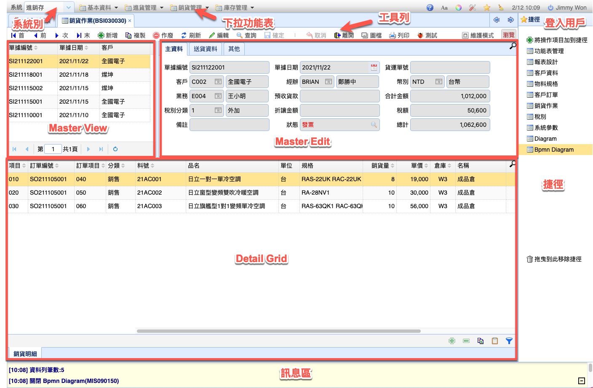

# 表單設計
表單資料表的瀏覽及維護

?>
表單設計需具備 html、css基礎
>[!tip]
參考連結 [w3schools Html](https://www.w3schools.com/html/default.asp)

## 表單配置

> 資料區塊說明
>
> 1. Master View 主資料瀏覽，每頁50筆
> 2. Master Edit 主資料編輯區
> 3. Detail Grids 明細資料瀏覽及編輯
> 4. 工具列 - 操作按鈕
> 5. 訊息區 - 操作訊息
> 6. 捷徑 - 個人快速開啟表單 (必須有權限)

