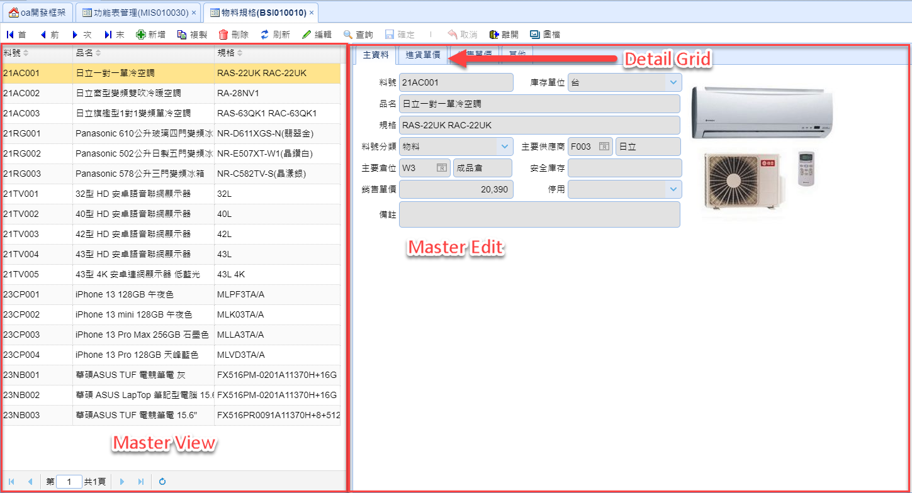
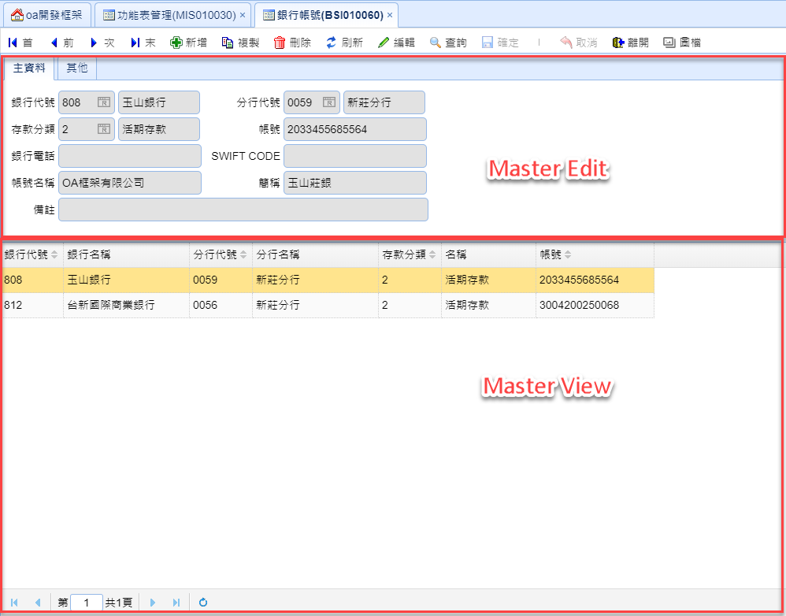
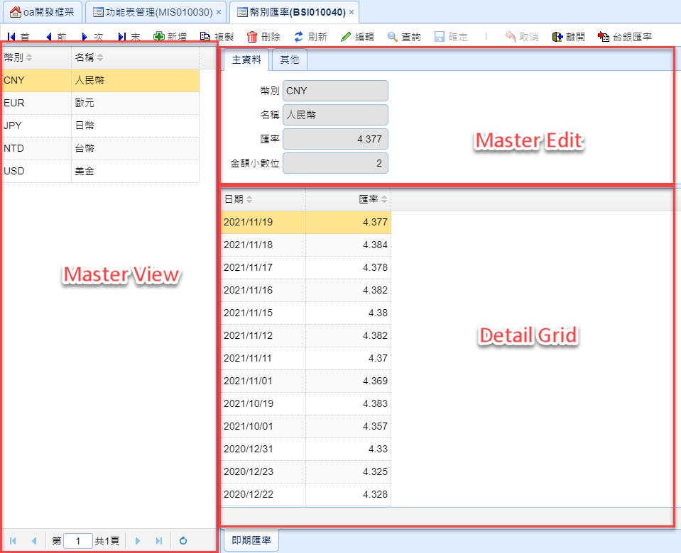
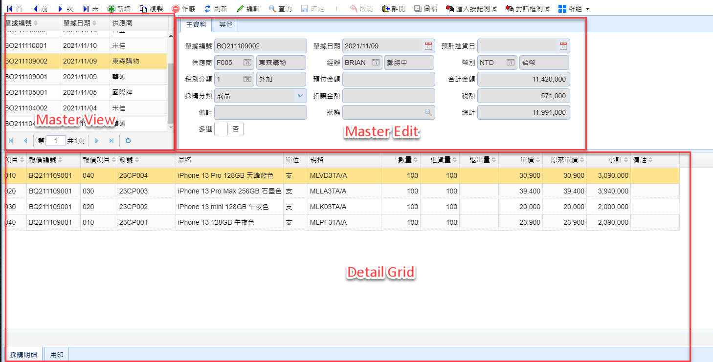
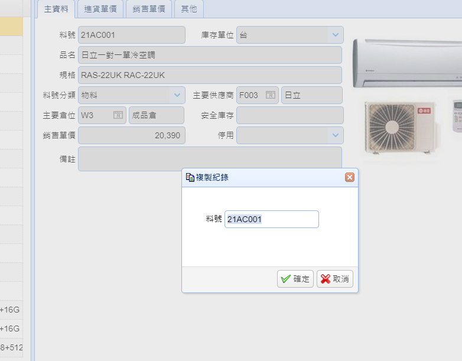

# 版型

### 表單配置一

useage: mater only | master detail



```html
<!-- Maintain Area -->
<div class="easyui-layout" data-options="fit:true">
  <div data-options="region:'north',border:false" style="height: 32px; padding: 0px; overflow-y: hidden;">
    <!-- Maintain Toolbar -->
    <div id="pnlToolbar" class="easyui-panel pnl-toolbar"></div>
    <!-- End of Maintain Toolbar -->
  </div>

  <!-- Master View -->
  <div id="pnlView" data-options="region:'west',broder:false,split:true" style="width: 400px; border: 0;">
    <!-- code -->
  </div>
  <!-- End of Master View -->

  <div data-options="region:'center',broder:false" style="background: #fff; border: 0;">
    <div class="easyui-layout" data-options="fit:true">
      <!--Master-->
      <div data-options="region:'center',border:false" style="height: 200px; background: #fff;">
        <div id="tabEdit" class="easyui-tabs" data-options="fit:true">
          <div title="<span data-i18n='主資料'></span>" style="padding: 10px;">
            <form fom-master>
              <!--Master Edit code-->
            </form>
          </div>

          <div title="<span data-i18n='明細'>">
            <table grd-detail>
              <!--Detail grid code-->
            </table>
          </div>

          <div title="<span data-i18n='其他'></span>" style="padding: 10px;">
            <form fom-master>
              <!--Master Edit code-->
            </form>
          </div>
        </div>
      </div>

      <!--End of Master-->
    </div>
  </div>
</div>

<!-- Copy Dialog -->
<div id="dlgCopy" style="width:320px;height:300px;">
  <form>
    <!-- key field -->
    <p><span data-i18n="{標籤}"></span><input name="{field_name}" /></p>
    <!-- End key field -->
  </form>
</div>
<!-- End of Copy Dialog -->

<!-- End of Maintrain Area -->
```

### 表單配置二

useage: mater only



```html
<!-- Maintain Area -->
<div class="easyui-layout" data-options="fit:true">
  <div data-options="region:'north',border:false" style="height:32px;padding:0px;overflow-y:hidden">

    <!-- Maintain Toolbar -->
    <div id="pnlToolbar" class="easyui-panel pnl-toolbar" data-options="fit:true">
    </div>
    <!-- End of Maintain Toolbar -->

  </div>

  <div data-options="region:'center',broder:false" style="background:#FFF;border:0">

    <div class="easyui-layout" data-options="fit:true">
      <div data-options="region:'north',broder:false,split:true" style="height:200px;padding:0px;border:0">
          <div id="tabEdit" class="easyui-tabs" data-options="fit:true">
            <!-- Master Edit code -->
          </div>
      </div>

      <!-- Master View -->
      <div id="pnlView" data-options="region:'center',broder:false" style="background:#FFF;border:0">
        <!-- Master View code -->
      </div>
      <!-- End of Master View -->
    </div>

  </div>

</div>

<!-- Copy Dialog -->
<div id="dlgCopy" style="width:320px;height:300px;">
  <form>
    <!-- key field -->
    <p><span data-i18n="{標籤}"></span><input name="{field_name}" /></p>
    <!-- End key field -->
  </form>
</div>
<!-- End of Copy Dialog -->
<!-- End of Maintrain Area -->
```

### 表單配置三

useage: master detail



```html
<!-- Maintain Area -->
<div class="easyui-layout" data-options="fit:true">

  <div data-options="region:'north',border:false" style="height:32px;padding:0px;overflow-y:hidden">
    <!-- Maintain Toolbar -->
    <div id="pnlToolbar" class="easyui-panel pnl-toolbar">
    </div>
    <!-- End of Maintain Toolbar -->
  </div>

  <!-- Master View -->
  <div id="pnlView" data-options="region:'west',split:true" style="width:310px;border:0">
    <table id="grdView">
      <!-- Master View code -->
    </table>
  </div>
  <!-- End of Master View -->

  <div data-options="region:'center'" style="background:#FFF;border:0">
    <div class="easyui-layout" data-options="fit:true">
      <div data-options="region:'north',split:true,border:false" style="height:410px;background:#FFF">
        <!--Master-->
        <div id="tabEdit" class="easyui-tabs" data-options="fit:true">
          <!-- Master Edit code -->
        </div>
        <!--End of Master-->
      </div>

      <!--Detail-->
      <div data-options="region:'center',border:false" style="background:#FFF">
        <div id="pnlDetail" class="easyui-tabs" data-options="fit:true,tabPosition:'bottom'">
          <!-- Detail Grid code -->
        </div>
      </div>
      <!--End of Detail -->

    </div>
  </div>

</div>

<!-- Copy Dialog -->
<div id="dlgCopy" style="width:300px;height:200px;">
  <form>
    <!-- key field -->
    <p><span data-i18n="{標籤}"></span><input name="{field_name}" /></p>
    <!-- End key field -->
  </form>
</div>
<!-- End of Copy Dialog -->
<!-- End of Maintrain Area -->
```

### 表單配置四

useage: master detail



```html
<!-- Maintain Area -->
<div class="easyui-layout" data-options="fit:true">

  <div data-options="region:'north',border:false" style="height:32px;padding:0px;overflow-y:hidden">
    <!-- Maintain Toolbar -->
    <div id="pnlToolbar" class="easyui-panel pnl-toolbar">
    </div>
    <!-- End of Maintain Toolbar -->
  </div>

  <div data-options="region:'center',broder:false" style="background:#FFF;border:0">
    <div class="easyui-layout" data-options="fit:true">
      <div data-options="region:'north',broder:false,split:true" style="background:#FFF;border:0;height:200px">
        <div class="easyui-layout" data-options="fit:true">

          <!--Master View-->
          <div id="pnlView" data-options="region:'west',broder:false,split:true" style="width:360px;padding:0px;border:0">
            <!-- Master View Code -->
          </div>
          <!--End of Master View-->

          <div data-options="region:'center',broder:false" style="background:#FFF;border:0">
            <!--Master-->
            <div id="tabEdit" class="easyui-tabs" data-options="fit:true">
              <!-- Master Edit Code -->
            </div>
            <!--End of Master-->
          </div>
        </div>
      </div>

      <div data-options="region:'center',broder:false" style="background:#FFF;border:0">
        <!--Detail-->
        <div id="pnlDetail" class="easyui-tabs" data-options="fit:true,tabPosition:'bottom'">
          <!-- Detail Grid Code -->
        </div>
        <!--End of Detail -->
      </div>
    </div>
  </div>
</div>

<!-- Copy Dialog -->
<div id="dlgCopy" style="width:300px;height:200px;">
  <form>
    <!-- key field -->
    <p><span data-i18n="{標籤}"></span><input name="{field_name}" /></p>
    <!-- End key field -->
  </form>
</div>
<!-- End of Copy Dialog -->
<!-- End of Maintrain Area -->
```

## 版面區塊

### Master View

```html
<div id="pnlView" data-options="region:'west',broder:false,split:true" style="width:560px;border:0">
  <table id="grdView">
    <thead data-options="frozen:true">
      <tr>
        <!-- View Field -->
        <th data-options="field:'prdno',width:115">
          <span data-i18n="料號"></span>
        </th>
        <!-- End of View Field -->
      </tr>
    </thead>
    <thead>
      <tr>
        <!-- View Field -->
        <th data-options="field:'prdna',width:115">
          <span data-i18n="品名"></span>
        </th>
        <!-- End of View Field -->
      </tr>
    </thead>
  </table>
</div>
```

### Master Edit

```html
<div id="tabEdit" class="easyui-tabs" data-options="fit:true">
  <div title="<span data-i18n='主資料'></span>" style="padding:10px">
      <form fom-master>
        <table>
          <tr>
            <td>
              <label for="{field_name}">
                <span data-i18n="{標籤}"></span>
              </label>
            </td>
            <td>
              <input name="{field_name}" class="w230">
            </td>
            <td>&nbsp;</td>
            <td>
              <label for="{field_name}"><span data-i18n="{標籤}"></span></label>
            </td>
            <td>
              <input name="{field_name}" class="w70">
              <input refset="reffld:'',keyfld:'',retfld:''" class="w108">
            </td>
          </tr>
        </table>
      </form>
    </div>
  </div>
  <div title="<span data-i18n='其他'></span>" style="padding:10px">
    <form fom-master>
      <table>
        <tr>
          <td><label for="crtuserid"><span data-i18n='建立者'></span></label></td>
          <td>
            <input name="crtuserid" class="w74">
            <input refset="reffld:'crtuserid',keyfld:'userid',retfld:'username'" class="w124">
          </td>
          <td>&nbsp;&nbsp;</td>
          <td><label for="upduserid"><span data-i18n='異動者'></span></label></td>
          <td>
            <input name="upduserid" class="w74">
            <input refset="reffld:'upduserid',keyfld:'userid',retfld:'username'" class="w124">
          </td>
        </tr>
      </table>
    </form>
  </div>
</div>
```

> 說明
>
> * 第一行
>   * title - 標題
> * 第二行 form 要寫上 fom-Master

### Detail Grid

```html
<div id="pnlDetail" class="easyui-tabs" data-options="fit:true,tabPosition:'bottom'">
  <div title="<span data-i18n='明細'></span>">
    <table grd-detail>
      <thead data-options="frozen:true">
        <tr>
          <th data-options="field:'dlvno',width:100,hidden:true"><span data-i18n='單號'></span></th>
          <th data-options="field:'item',width:100"><span data-i18n='項次'></span></th>
          <th data-options="field:'prdno',width:100"><span data-i18n='料號'></span></th>
        </tr>
      </thead>
      <thead>
        <tr>
          <th data-options="field:'saleqty',width:120"><span data-i18n='數量'></span></th>
          <th data-options="field:'saleprc',width:120"><span data-i18n='單價'></span></th>
          <th data-options="field:'saleamt',width:120"><span data-i18n='小計'></span></th>
          <th data-options="field:'rem',width:120"><span data-i18n='備註'></span></th>
        </tr>
      </thead>
    </table>
  </div>
</div>
```

> 說明
>
> * 第一行
>   * title - 標題
> * 第二行 table 要寫上 grd-detail

### Copy Dialog

複製時跳出視窗 提供可快速修改的欄位

> 範例

```html
<!-- Copy Dialog -->
<div id="dlgCopy" style="width:300px;height:200px;">
  <form>
    <!-- key field -->
    <p><span data-i18n='料號'></span><input name="prdno"></p>
    <!-- End key field -->
  </form>
</div>
<!-- End of Copy Dialog -->
```

> 結果


