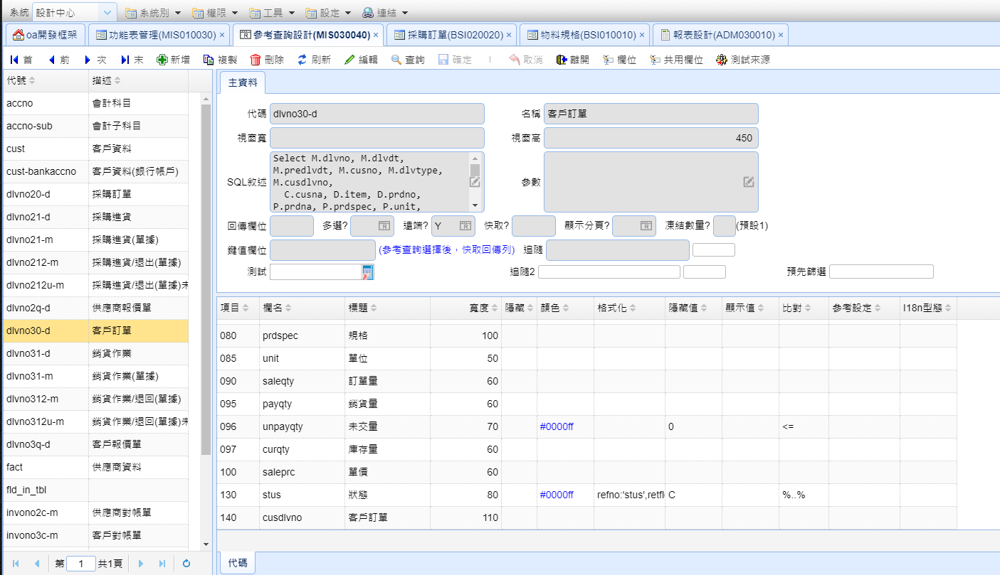
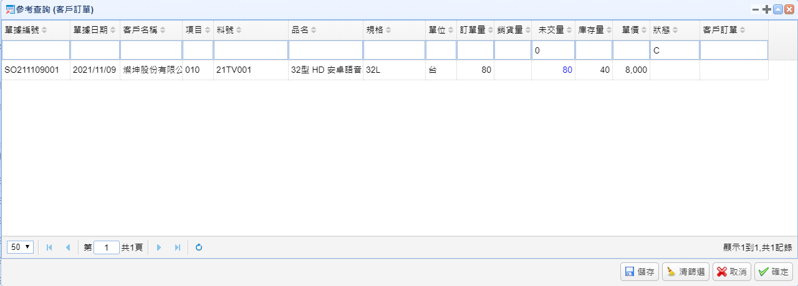

# 參考查詢設計

## 畫面

## 主資料 (Master Edit)

#### 代碼

參考查詢的編號

#### 名稱

#### 視窗寬

查詢時的視窗寬度

#### 視窗高

查詢時的視窗高度

#### SQL敘述

撈取的資料

#### 參數

略

#### 回傳欄位

回傳的欄位值

#### 多選

是否為多選的參考查詢

#### 遠端

> * Y: 即時查詢 
> * 其他: 本地端快取

#### 快取

略

#### 顯示分頁

是否要有分頁 預設: 是

#### 凍結數量

凍結欄位使滾動時欄位固定不動 預設: 1 (凍結一個欄位)

#### 鍵值欄位

略

#### 追隨

略

#### 追隨2

略

#### 預先篩選

略

#### 測試

打開查詢的畫面

## 代碼 (Detail Grid)

設定好SQL敘述後可以利用工具列的"欄位"按鈕自動解析

> 畫面預覽

#### 項目

用來排序的編號

#### 欄名

欄位名稱

#### 標題

欄位標籤

#### 寬度

欄位的寬度

#### 隱藏

隱藏欄位

#### 顏色

欄位的文字顏色(16進位 或 顏色名稱)

#### 格式化

欄位格式化(改變顯示內容)

> 範例 refno:'stus',retfld:'codena'\
> 參數
> * refno - 參考查詢代碼
> * retfld - 回傳欄位值

#### 隱藏值

隱藏該欄位的值

> 範例: 0 ，"比對"欄位的條件是<= 結果 隱藏搜索到的值是小於等於 0 的資料

#### 顯示值

顯示該欄位的對應值

> 範例: 1，"比對"欄位的條件是>= 結果 顯示 搜索到的值 大於等於 1 的資料

#### 比對

是 隱藏值 , 顯示值 欄位的條件

#### 參考設定

略

#### I18n型態

多國語言翻譯
