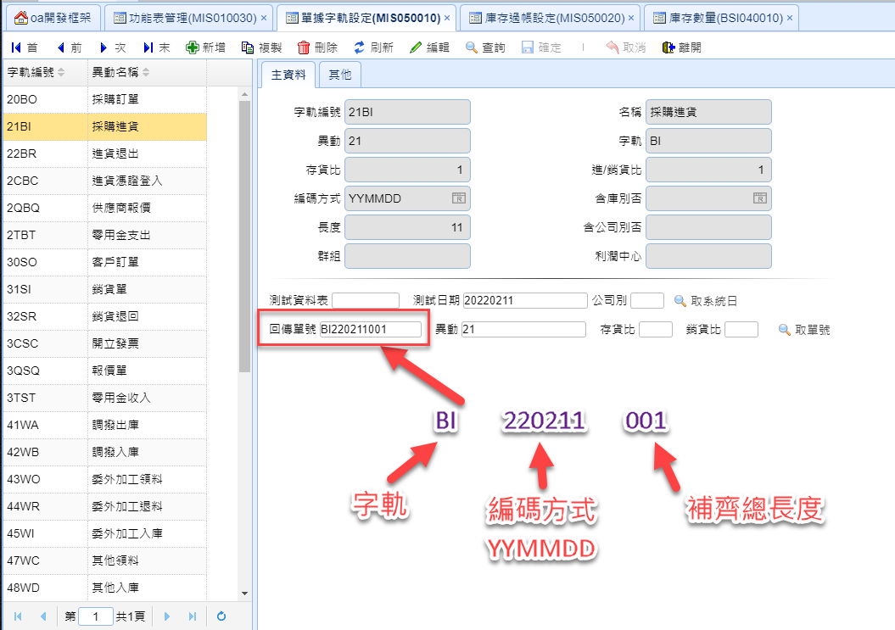

# 單據字軌設定
?>
單據自動編號的設定

## 編碼組合方式

## 主資料

#### 字軌編號

"異動" + "字軌"

#### 名稱

字軌名稱

#### 異動

異動代號

#### 字軌

字軌編碼，例如:發票的前兩碼英文字母

#### 存貨比

對存貨的數量加減

> 參數
>
> * 1 - 庫存\*1
> * \-1 - 庫存\*-1
>
> 範例
>
> * 採購進貨 - 庫存因進貨設定: 1
> * 銷貨 - 庫存因銷貨設定: -1
> * 銷貨退回 - 庫存因退回設定: 1

#### 進/銷貨比

對進貨 或 銷貨 的數量加減

> 參數
>
> * 1 - 庫存\*1
> * \-1 - 庫存\*-1
>
> 範例
>
> * 採購進貨 - 因進貨設定: 1
> * 銷貨 - 因銷貨設定: 1
> * 銷貨退回 - 因退回設定: -1

#### 編碼方式

自動編號規則

> 參數
>
> * YYYYMMDD - 西元年月日(8碼)
> * YYYYMM - 西元年月日(6碼)
> * YYMMDD - 西元年月日(6碼)
> * EEEMMDD - 民國年(7碼)
> * EEEMM - 民國年(5碼)

#### 含庫別否

是否含庫別

#### 長度

整個編碼的總長度

#### 含公司別否

是否含公司別

#### 群組

略

#### 利潤中心

略

### 測試工具

測試自動編號設定

#### 測試資料表

選擇一個資料表

#### 測試日期

可以自訂日期 也可以按"取系統日" 取得當天日期

#### 公司別

公司別代號

### 按"取單號"按鈕時

#### 回傳單號

取得組合好的編號

#### 異動

存貨異動

#### 存貨比

略

#### 銷貨比

略
