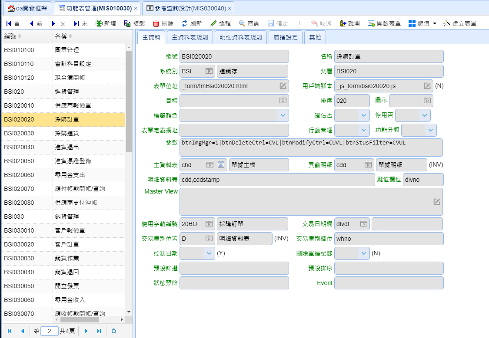
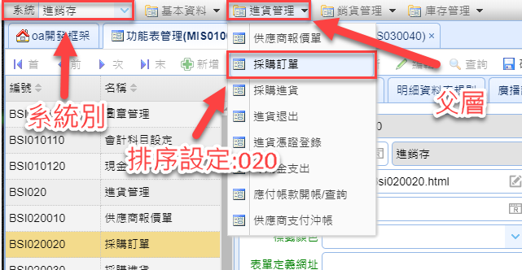
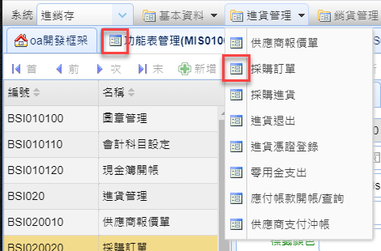
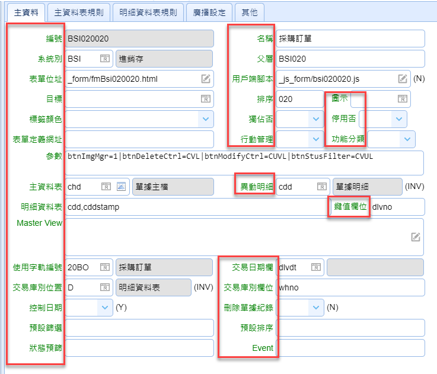
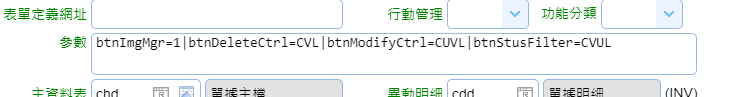
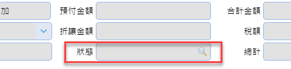
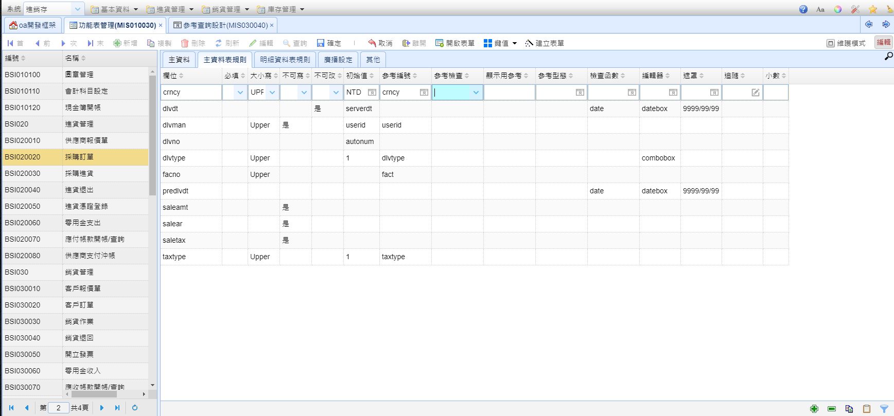
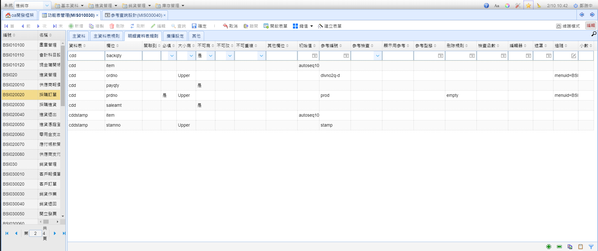
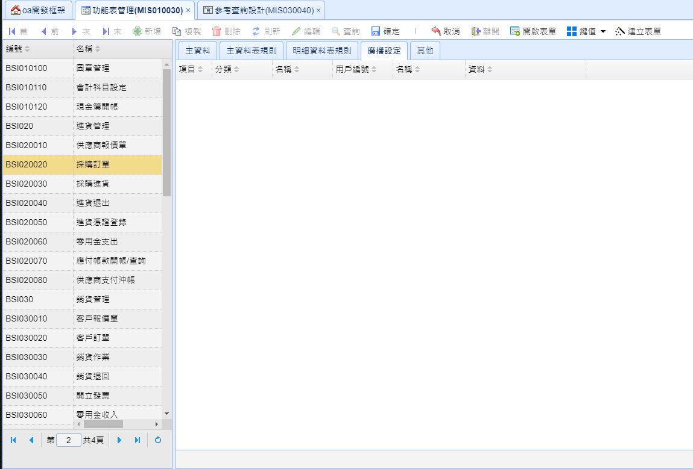

# 功能表管理

## 主資料



#### 編號

表單編號

#### 名稱

表單名稱

#### 系統別

系統別

> 圖例



#### 父層

設定 父層 的功能表編號

> 圖例 可參考 系統別

#### 表單位址

表單版型 的路徑

#### 用戶端腳本

用戶端腳本 的路徑

#### 目標

開啟方式

> * \_blank - 開新視窗
> * \_self - 同視窗
> * \_parent - 父層視窗

#### 排序

功能表項目順序

> 圖例 可參考 系統別

#### 圖示

功能表項目圖示

> 圖例



#### 標籤顏色

表單欄位的標籤顏色

> 圖例



#### 獨佔否

用獨佔視窗開啟

#### 停用否

是否停用此項目

#### 表單定義網址

略 Legacy

#### 行動管理

手機版使用

#### 功能分類

略

#### 參數

功能表擴充參數，用 keypair 方式設定，用 | 分隔

* 以下 \[stus] 是指依照表單狀態欄位時

> 範例
>
> 

> * MasterInsert=N 隱藏工具列"新增"按鍵
> * MasterCopy=N 隱藏工具列"複製"按鍵
> * MasterModify=N 隱藏工具列"編輯"按鍵
> * MasterDelete=N 隱藏工具列"刪除"或是"作廢"按鍵
> * btnStusFilter=\[stus] 設定 master Edit 裡 狀態(stus) 欄位，可以有哪些參數。
>
> 
> * btnDeleteCtrl=\[stus] 關閉工具列的"刪除"按鍵
> * btnModifyCtrl=\[stus] 關閉工具列的"編輯"按鍵
> * disableGrd=\[num] 設定Detail Grid唯讀 多個Detail Grid用逗號分隔
>   * 範例 disableGrd=0,1
>   * 結果 第一個及第二個Detail Grid設定唯獨
> * btnImgMgr=1 功能表工具列增加圖檔按鈕，使該功能表可以增加圖檔(附件)
> * repno=ADM010020 創建一個表單列印按鈕

#### 主資料表 (Master)

設定該功能表對應的資料表

#### 異動明細

設定異動(trn)要記錄在哪個資料表上

#### 明細資料表 (Deatil)

該功能表對應的Detail資料表

#### 鍵值欄位

主資料表 的鍵值

#### Master View

使用 sql 抓取的資料，優先於主資料表定義

#### 使用字軌編號

自動編號的字軌設定(定義在 單據字軌設定)

#### 交易日期欄

Master 的日期欄位，自動編號使用

#### 交易庫別位置

庫別欄位，即時庫存過帳用

#### 控制日期

略

#### 刪除單據紀錄

允許該功能表可以刪除單據紀錄 預設:否

#### 預設篩選

設定Master資料的篩選條件

> 範例
>
> ```sql
> invotype='1' And IfNull(beg_y,'')=''
> ```

#### 預設排序

設定Master資料的排序

> 範例
>
> ```sql
> invodt Desc, invono Desc
> ```

#### 狀態預篩

用狀態欄位預篩Master資料

> 範例:
>
> ```javascript
> !V
> ```
>
> 結果: 只顯示非作廢

#### Event

設定 PHP 事件(後端)

> 範例 BSI020020 對應 Bsi020020Event.php

## 主資料表規則 (Master Edit)



#### 欄位

欄位名稱

#### 必填

是否必填

#### 大小寫

英文自動轉大/小寫

#### 不可寫

新增或編輯時 唯讀

#### 不可改

編輯時 唯讀

#### 初始值

新增時 自動帶入

#### 參考編號

設定 參考查詢 的編號

#### 參考檢查

檢查使用者的輸入是否在參考查詢中

> * N: 不檢查
> * 預設: 是

#### 顯示用參考

略

#### 參考型態

略

#### 檢查函數

檢查函數

#### 編輯器

> * datebox - 日期選擇器
> * textarea - 文字編輯器
> * combobox 下拉式選單 注意: 此功能僅限用在參考查詢的欄位只有2列時使用
> * numberbox - 數字欄位
> * phpeditor - PHP 語法 編輯器
> * sqleditor - SQL 語法 編輯器

#### 遮罩

輸入遮罩

> 範例: 9999/99/99 結果: 日期遮罩

#### 追隨

開啟功能表及查詢

> 範例
> ```
> menuid=BSI010010|qryfld=prdno,whno|valfld=prdno,whno
> ```
> 說明
>
> 開啟BSI010010功能表查詢對應的prdno值的資料 參數
>
> * menuid - 要開啟的功能表
> * qryfld
>   * 要開啟往的功能表查詢的欄位名稱
>   * 多個欄位用逗號分隔
> * valfld
>   * 要依照目前哪個欄位名稱的值
>   * 多個欄位用逗號分隔

#### 小數

小數點後幾位

## 明細資料表規則 (Detail Grid)



#### 資料表

明細資料表名稱

#### 欄位

欄位名稱

#### 關聯到

關聯欄位，當明細與主資料表關聯欄位名稱不同時須設定

#### 必填

是否必填

#### 大小寫

英文自動轉大/小寫

#### 不可寫

新增或編輯時 唯讀

#### 不可改

編輯時 唯讀

#### 不可重複

主鍵值不可重複

#### 其他欄位

略

#### 初始值

新增時 自動帶入

#### 參考編號

設定 參考查詢 的編號

#### 參考檢查

檢查使用者的輸入是否在參考查詢中

> * N: 不檢查
> * 預設: 是

#### 顯示用參考

略

#### 參考型態

略

#### 刪除規則

不符合條件時刪除單筆資料

#### 檢查函數

檢查函數

#### 編輯器

> * datebox - 日期選擇器
> * textarea - 文字編輯器
> * combobox 下拉式選單 注意: 此功能僅限用在參考查詢的欄位只有2列時使用
> * numberbox - 數字欄位
> * phpeditor - PHP 語法 編輯器
> * sqleditor - SQL 語法 編輯器

#### 遮罩

輸入遮罩

> 範例: 9999/99/99\
> 結果: 日期遮罩

#### 追隨

開啟功能表及查詢

> 範例
> ```
> menuid=BSI010010|qryfld=prdno,whno|valfld=prdno,whno
> ```
> 說明
> * menuid - 要開啟的功能表
> * qryfld
>   * 要開啟往的功能表查詢的欄位名稱
>   * 多個欄位用逗號分隔
> * valfld
>   * 要依照目前哪個欄位名稱的值
>   * 多個欄位用逗號分隔

#### 小數

小數點後幾位

## 廣播設定
略

