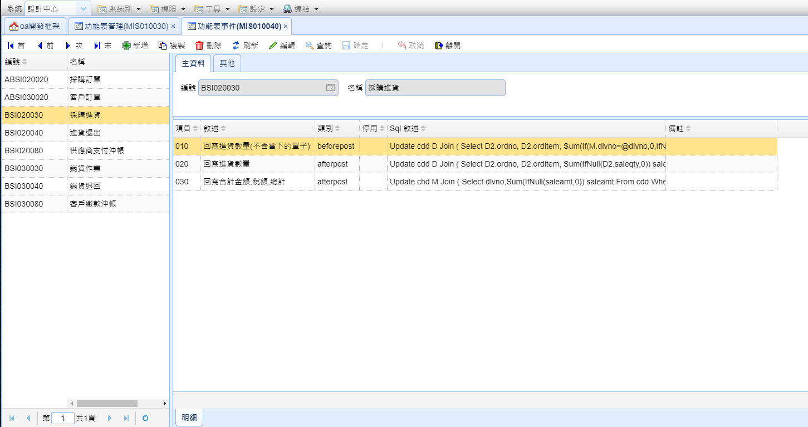

# 功能表事件

設定好事件之後請至 [功能表事件] > [主畫面] > [Event] 欄位加上功能表編號

## 畫面

## 主畫面 Master Edit

#### 編號

表單編號

#### 名稱

表單名稱

## 明細 Detail Grid

#### 項目

排序的編號

#### 敘述

項目說明

#### 類別

> * beforePost 表單儲存前
> * afterPost 表單儲存後
> * bothPost 表單儲存前後

#### 停用

停用項目

#### SQL敘述

要執行的語法

> 參數來源為 Master Edit Data 資料

#### 備註
