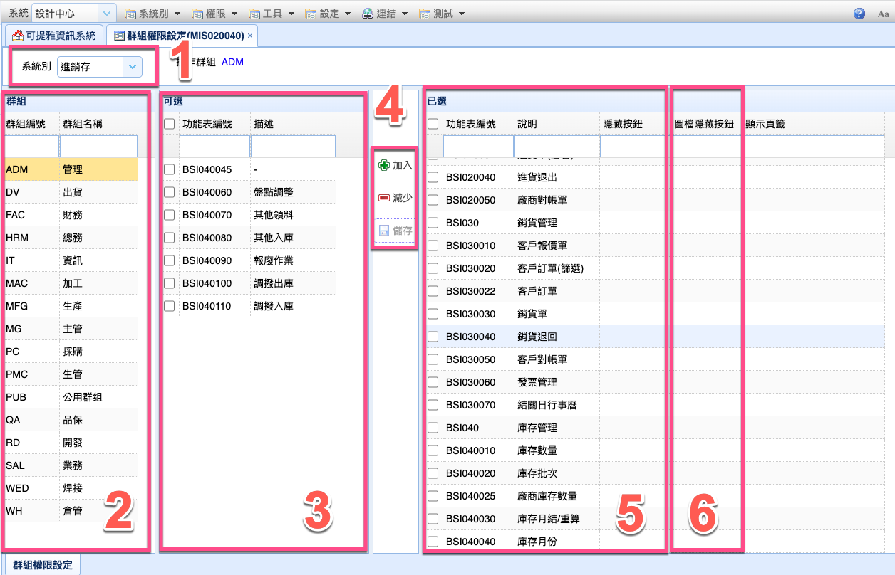

# 權限設定
?>
基本權限設定

## 畫面

## 設定流程

以下設定 依照圖片的編號

#### 新增權限

依照以下步驟操作

> 1. 請先選擇系統別 (圖示.1) \
> 2. 選擇要更改的群組 (圖示.2) \
> 3. 選擇要增加的權限 (圖示.3) \
> 4. 選擇 增加 (圖示.4) \
> 5. 最後 存檔 (圖示.4) 

#### 移除權限

依照以下步驟操作

> 1. 請先選擇系統別 (圖示.1) \
> 2. 選擇要更改的群組 (圖示.2) \
> 3. 選擇要移除的權限 (圖示.5) \
> 4. 選擇 減少 (圖示.4) \
> 5. 最後 存檔 (圖示.4)

## 圖示.5 欄位說明

#### 隱藏按鈕

設定 畫面上方 工具列 按鈕 隱藏

> 代碼
> * A - 新增 
> * C - 複製
> * D - 刪除
> * M - 編輯
>
> 範例 : ACD \
> 說明 : 隱藏 "新增, 複製, 刪除"

