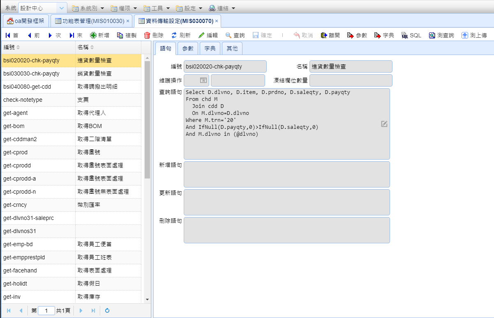

# 資料傳輸設定

## 畫面

## 語句

#### 編號

資料傳輸設定編號

#### 名稱

資料傳輸設定名稱

#### 維護操作

略

#### 凍結欄位數量

設定滾動時要凍結的欄位

#### 查詢語句

使用 sql 抓取的資料

#### 新增語句

略

#### 更新語句

略

#### 刪除語句

略

## 參數

如果有設定SQL語句 可以用工具鈕"參數"來自動解析

#### 項目

排序的編號

#### 參數

欄位名稱

#### 型態

欄位的型態

> * varchar
> * decimal
> * text

#### 初始值

使用者呼叫時自動填入

#### 測試值

使用工具鈕"測查詢"所使用的參數

#### 比對

> 參數
>
> * ..% - 開頭比對
> * %.. - 結尾比對
> * %..% - 包含比對

## 字典

如果有設定SQL語句 可以用工具鈕"字典"來自動解析

#### 項目

排序的編號

#### 欄名

欄位名稱

#### 標題

標籤名稱

#### 鍵值

是否為建值
