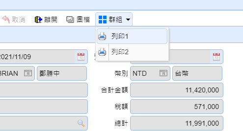
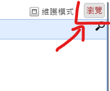
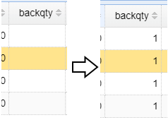

# JS 開發文件
?>
前端開發 (javascript)

## 用戶端腳本 (form plugin)，FormCtrl6 的方法

紀錄維護表單，新增或改變表單的預設行為

### 腳本樣板

```javascript
//create form control
createFormCtrl6();

/**
 * Custom Control
 */
function FormCtrl6C(objM, objD){
  this.name = objM.name;
  this.objM = objM;
  this.objD = objD;
  var obj = this;
  var tabEdit;

  this.init = function() {
    tabEdit = objM.tabEdit;
  }

  this.setToolbar = function() {
    //
  }
}
```

> obM - Master controller 使用 objM.method 呼叫&#x20;
>
> objD - Detail controller 使用 objD.method 呼叫&#x20;

## 初始設定

### this.init()
_範例一_

```javascript
  this.init = function() {
    objM.copyEmpty['mas'] = [];               // 複製時       Master 要刪除資料的欄位
    objM.copyEmpty['det'] = ['rem','rem2'];   // 複製時 第0個 Detail 要刪除資料的欄位
    objM.copyEmpty['det1'] = ['rem','rem2'];  // 複製時 第1個 Detail 要刪除資料的欄位
    objM.copyEmpty['det2'] = ['rem','rem2'];  // 複製時 第2個 Detail 要刪除資料的欄位
    
  }
```

> 說明
> * objM.copyEmpty 設定 複製時需要刪除的欄位
>   * objM.copyEmpty['mas']      複製時       Master 要刪除資料的欄位
>   * objM.copyEmpty['det']      複製時 第0個 Detail 要刪除資料的欄位
>   * objM.copyEmpty['det{n}']   複製時 第n個 Detail 要刪除資料的欄位

## Router _取得api路徑_

### objM.getapi(route, \[path])

_範例一_

```javascript
// 在 bsi020020 呼叫
objM.getApi('get-prdno')
```

> 結果: http://api2.oa-rapid.com/bsi020020/get-prdno

_範例二_

```javascript
// 在 任何地方 呼叫
objM.getApi('get-prdno','bsi010010')
```

> 結果: http://api2.oa-rapid.com/bsi010010/get-prdno

_範例三_

```javascript
// 在 任何地方 呼叫
objM.getApi('get','pub')
```

> 結果: http://api2.oa-rapid.com/pub/get-server-date

## 工具列按鈕

### objM.addToolButton(id, tooltip, img\_name, event);

工具列按鈕

```javascript
objM.addToolButton('btnId', '列印', 'icon-print', () => {
    // code
});
```

### objM.addMenuButton(id, tooltip, img\_name, event);

工具列下拉按鈕及下拉功能表按鈕

```javascript
objM.addToolButton('btnId', '群組', 'icon-menu-b', 'menubutton');
objM.addMenuButton('btnId2', '列印1', 'icon-print', () => {
    // code
});
objM.addMenuButton('btnId3', '列印2', 'icon-print', () => {
    // code
});
```



## 表單內按鈕

### objM.switchButtonChange(name, cb)

設定一個 switch 按鈕

```javascript
objM.switchButtonChange('_multi', (check) => {
    con(check)
})
```

### objM.makeButton(option)

製作連結按鈕

```javascript
objM.makeButton({
  id: 'btnid',
  iconCls: 'icon-reset',
  onClick: () => {
    //code
  }
})
```

> option 參數說明
>
> * id - 編號
> * iconCls - 圖示
> * onClick - 單擊事件

### objM.setButtonEnable(id, boolean)

按鈕開關

```javascript
objM.setButtonEnable('btnid', false)
```

> 結果: 關閉按鈕 btnid

## Master view 操作

### objM.getViewRows()

取得當前 所有 view 值

```javascript
objM.getViewRows()
```

> 會取得 Master View 的資料

```javascript
[
  {
    dlvno: "BO211115001",
    dlvdt: "20211115",
    facno: "F003",
    facna2: "日立",
  },
  ...
    // 7筆資料 //
  ...
  {
    dlvno: "BO211104001",
    dlvdt: "20211104",
    facno: "F002",
    facna2: "華碩",
  },
]
```

### objM.getViewRow(\[idxRow])

取得單一列 view 值

> idxRow : 選擇要讀取哪一列，是以 0 為第一筆

_範例一_

```javascript
objM.getViewRow()
```

> 取得當前 Master View 所選的資料

```javascript
{
  dlvno: "BO211109002",
  dlvdt: "20211109",
  facno: "F005",
  facna2: "東森購物",
}
```

_範例二_

```javascript
objM.getViewRow(3)
```

> 取得第4筆的 Master View 資料

```javascript
{
  dlvno: "BO211110001",
  dlvdt: "20211110",
  facno: "F001",
  facna2: "米佳",
}
```

### objM.setViewRow(row, \[idxRow])

設定 view 值

> row : 以 object 方式傳入要修改的資料 <br>
>
> idxRow : 選擇要讀取哪一列，是以 0 為第一筆

_範例一_

```javascript
var row = {
  facna2: '文字更改',
}
objM.setViewRow(row)
```

> 更改當前 Master View 所選的資料

_範例二_

```javascript
var row = {
  facna2: '文字更改',
}
objM.setViewRow(row,3)
```

> 更改第4筆的 Master View 資料

### objM.refreshView()

```javascript
objM.refreshView()
```

> 將 Master View 刷新

## Master Edit 操作

### objM.getInput(String field)

取得 input 欄位物件

```javascript
objM.getInput('dlvno')
```

### objM.getInputValue(String field)

取得 input 欄位 值

```javascript
objM.getInputValue('dlvno')
```

> 結果: "BO211109002"


### objM.setInputReadonly(String fdna, Boolean bReadonly)

> 設定edit唯讀

```js
objM.setInputReadonly('sugprc', true);
```

### objM.setInputRequired(fdna, bRequired)

> 設定edit必須輸入

```js
objM.setInputRequired('sugprc', true);
```

### objM.setInputValue(String|Element field, val)

設定 input 值

_範例一_

```javascript
objM.setInputValue("rem","文字更改");
```

> 更改 Master Data 內的 rem 欄位

_範例二_

```javascript
var element = objM.getInput('rem')
objM.setInputValue(element,'文字更改')
```

> 以搜尋出來的 欄位 進行修改

## Master Dataset 操作

### objM.getMasterData()

取得 整個 master 值

```javascript
objM.getMasterData()
```

> 結果:

```javascript
{
  dlvno: "BO211109002",
  dlvdt: "20211109",
  predlvdt: "",
  facno: "F005",
  facno-facna2: "東森購物",
  dlvman: "BRIAN",
  dlvman-username: "鄭勝中",
  crncy: "NTD",
  crncy-crncyna: "台幣",
  decim: "",
  taxtype: "1",
  taxtype-taxna: "外加",
  prepayamt: 0,
  saleamt: 11420000,
  dlvtype: "2",
  disamt: 0,
  saletax: 571000,
  taxrate: "0.05",
  rem: "文字",
  stus: "",
  stus-codena: "",
  salear: 11991000,
  crtuserid: "BRIAN",
  crtuserid-username: "鄭勝中",
  upduserid: "BRIAN",
  upduserid-username: "鄭勝中",
  crtdtm: "2021-12-06 09:01:46",
  upddtm: "2021-12-06 09:01:46",
}
```

### objM.setMasterData(object row)

設定 多筆 master 值

```javascript
var row = {
  saleamt: 123,
  dlvtype: "1",
  disamt: 5,
  saletax: 456,
  taxrate: "0.1",
}
objM.setMasterData(row)
```

## 事件 (event)

### this.fnBeforeVoid(callback)

當要作廢前

```javascript
this.fnBeforeVoid = function(callback) {
  var canVoid = true;
  //code
  callback(canVoid);
}
```

> 參數說明
>
> * callback - 這是一個 function
>
> 最後要回傳 callback 來決定時否確定要作廢單據

### this.fnBeforePost(callback)

儲存前&#x20;

```javascript
this.fnBeforePost = function(callback) {
  var canSave = true;
  //code
  callback(canSave);
}
```

> 參數說明
>
> * callback - 這是一個 function
>
> 最後要回傳 callback 來決定時否確定要儲存

### this.fnBeforeClose()

關閉表單前

```javascript
this.fnBeforeClose = function(callback) {
  var canSave = true;
  //code
  callback(canSave);
}
```

> 參數說明
>
> * callback - 這是一個 function
>
> 最後要回傳 callback 來決定時否確定要關閉表單

### this.fnAfterInsert()

新增後

```javascript
this.fnAfterInsert = function() {
  //code
}
```

### this.fnAfterEdit()

編輯後

```javascript
this.fnAfterEdit = function() {
  //code
}
```

### this.fnAfterCopy()

複製後

```javascript
this.fnAfterCopy = function() {
  //code
}
```

### this.fnAfterPost()

儲存後

```javascript
this.fnAfterPost = function() {
  //code
}
```

### this.fnAfterVoid()

作廢後

```javascript
this.fnAfterVoid = function() {
  //code
}
```

### this.fnAfterScroll(res)

* 刷新Master(按刷新鈕 或 儲存)
* Master View 移動

```javascript
this.fnAfterScroll = function(res) {
  //code
}
```

> 圖檔/附件資料會自動帶在res中 \
> 透過撰寫 \[menuid]Event.php 裡的 function afterScroll 回傳的資料，也會帶在 res

### this.fnAfterGrdViewLoad()

Master View 刷新時

```javascript
this.fnAfterGrdViewLoad = function() {
    //code
}
```

### this.fnModelChange(field, value)

當 Master Data 欄位 被修改時

```javascript
this.fnModelChange = (field, value) => {
    //code
}
```

### this.fnStateChange()

表單狀態改變

```javascript
this.fnStateChange = function() {
    //code
}
```



### this.fnCancelEdit()

取消編輯

```javascript
this.fnCancelEdit = function() {
    //code
}
```

### this.fnOnQuery()

查詢時

```javascript
this.fnOnQuery= function() {
    //code
}
```

## Detial Data 修改

### 當detail 被編輯時


### objD.getEditData(\[field])

取得 當前正在修改的那一列 值

_範例一_

```javascript
objD.getEditData()
```

> 結果:

```javascript
{
  item: "020",
  ordno: "BQ211109001",
  orditem: "030",
  prdno: "23CP003",
  saleqty: 100,
  payqty: 100,
  backqty: 0,
  saleprc: 39400,
  orgprc: 39400,
  saleamt: 3940000,
  rem: "",
}
```

_範例二_

```javascript
objD.getEditData('prdno')
```

> 結果: "23CP003"

### objD.setEditData(Object row)

設定 當前正在修改的那一列 值

### objD.getRow(\[idxGrd], \[idxRow])

取得 單一筆值

_範例一_

```javascript
objD.getRow()
```

> 取得Detial當前分頁及該分頁所選列

_範例二_

```javascript
objD.getRow(0)
```

> 取得Detial第1分頁及該分頁所選列

_範例三_

```javascript
objD.getRow(0,1)
```

> 取得Detial第1分頁及該分頁的第2列

> 取回的資料範例

```javascript
{
  dlvno: "BO211109002",
  item: "020",
  ordno: "BQ211109001",
  orditem: "030",
  prdno: "23CP003",
  saleqty: "100",
  payqty: "100",
  backqty: null,
  saleprc: "39400.00",
  orgprc: "39400.00",
  saleamt: "3940000",
  prdna: "iPhone 13 Pro Max 256GB 石墨色",
  unit: "支",
  prdspec: "MLLA3TA/A",
}
```

### objD.getRows(\[idxGrd])

取得 整個分頁值

_範例一_

```javascript
objD.getRows()
```

> 取得當前分頁的值

_範例二_

```javascript
objD.getRows(0)
```

> 取得第1分頁的值

> 結果

```javascript
[
  {
    dlvno: "BO211109002",
    item: "010",
    ordno: "BQ211109001",
    orditem: "040",
    prdno: "23CP004",
    saleqty: "100",
    payqty: "100",
    backqty: null,
    saleprc: "30900.00",
    orgprc: "30900.00",
    saleamt: "3090000",
    prdna: "iPhone 13 Pro 128GB 天峰藍色",
    unit: "支",
    prdspec: "MLVD3TA/A",
  },
  ...
    // 2筆資料 //
  ...
  {
    dlvno: "BO211109002",
    item: "040",
    ordno: "BQ211109001",
    orditem: "030",
    prdno: "23CP001",
    saleqty: "100",
    payqty: "100",
    backqty: null,
    saleprc: "23900.00",
    orgprc: "23900.00",
    saleamt: "2390000",
    prdna: "iPhone 13 128GB 午夜色",
    unit: "支",
    prdspec: "MLPF3TA/A",
  },
]
```

### objD.getSelections(idxGrd)

取得detail所選資料

```javascript
objD.getSelections(1)
```

> 取得第1分頁 所選資料

### objD.updateRow(idxGrd, idxRow, Object row)

單一筆資料部分修改

```javascript
var row = {
  saleqty:"150",
}
objD.updateRow(0,0,row)
```

> 更改第1分頁 第1筆 saleqty 資料

### objD.updateRows(idxGrd, Array rows)

整個分頁資料部分修改

```javascript
var rows = [
  {
    saleqty:"150",
  },
  {
    saleqty:"140",
  },
  {
    saleqty:"130",
  },
  {
    saleqty:"120",
  },
]
objD.updateRow(0,0,rows)
```

> 更改第1分頁 saleqty 資料 注意: 此修改方式請確認要改的列數要一致，避免資料修改錯誤

### objD.setRow(idxGrd, idxRow, Array rows)

單一筆資料替換

```javascript
var row = {
  dlvno: "BO211109002",
  item: "020",
  ordno: "BQ211109001",
  orditem: "030",
  prdno: "23CP003",
  saleqty: "100",
  payqty: "100",
  backqty: null,
  saleprc: "39400.00",
  orgprc: "39400.00",
  saleamt: "3940000",
  prdna: "iPhone 13 Pro Max 256GB 石墨色",
  unit: "支",
  prdspec: "MLLA3TA/A",
}
objD.setRow(0,0,row)
```

> 直接替換第1分頁 第1筆 資料

### objD.setRows(idxGrd, Array rows)

整個分頁資料替換

```javascript
var row = [
  {
    dlvno: "BO211109002",
    item: "010",
    ordno: "BQ211109001",
    orditem: "040",
    prdno: "23CP004",
    saleqty: "100",
    payqty: "100",
    backqty: null,
    saleprc: "30900.00",
    orgprc: "30900.00",
    saleamt: "3090000",
    prdna: "iPhone 13 Pro 128GB 天峰藍色",
    unit: "支",
    prdspec: "MLVD3TA/A",
  },
  ...
    // 2筆資料 //
  ...
  {
    dlvno: "BO211109002",
    item: "040",
    ordno: "BQ211109001",
    orditem: "030",
    prdno: "23CP001",
    saleqty: "100",
    payqty: "100",
    backqty: null,
    saleprc: "23900.00",
    orgprc: "23900.00",
    saleamt: "2390000",
    prdna: "iPhone 13 128GB 午夜色",
    unit: "支",
    prdspec: "MLPF3TA/A",
  },
]
objD.setRow(0,row)
```

> 直接替換第1分頁 資料

### objD.setColumn(idxGrd, Object cols)

更改整個分頁欄位值

```javascript
var cols = {
  backqty:'1',
}
objD.setColumn(0,cols)
```

> 更改整個分頁 backqty 值

> 結果



### objD.setGridCheckbox(Int/Element grd, multi\_y, colname)

Detial 多選/單選 按鈕 控制

> html 需要有

```html
<th data-options="field:'ck',checkbox:true"></th>
```

_範例一_

```javascript
  var check = true;
  objD.setGridCheckbox(0, check, 'ck');
```

_範例二_

```javascript
  objM.switchButtonChange('_multi', (check) => {
    objD.setGridCheckbox(0, check,'ck');
    translate($(`#pnlDetail${obj.name}`));
  })
```

> 搭配objM.switchButtonChange 可以製作一個方便開關的按鈕

## Detail事件

### this.fnDetailBeforePost(callback)

當表單儲存前

```javascript
this.fnDetailBeforePost = function(callback) {
  var canSave = true;
  //code
  callback(canSave);
}
```

> 參數說明
>
> * callback - 這是一個 function
>
> 最後要回傳 callback 來決定時否確定要儲存

### this.fnDetailBeforePasteRows()

貼上前

```javascript
this.fnDetailBeforePasteRows = function(idxGrd, new_rows){
  //code
}
```

> 參數說明
>
> * idxGrd - 明細分頁
> * new\_rows - 以 List 包 object 型態 取得使用者貼上的資料

### ~~this.fnBeforeEditRow()~~

### this.fnBeforeDeleteRow(idxGrd, row)

單項刪除前

```javascript
this.fnBeforeDeleteRow = (idxGrd, row) => {
    //code
    var success = false;
    return success;
}
```

> 參數說明
>
> * idxGrd - 第幾個分頁
> * row - 要刪除的那一項資料
>
> 最後要回傳 true | false 如果是 false 就會阻擋 刪除的動作

### this.fnBeforeDeleteRows(idxGrd, row)

多項刪除前

```javascript
this.fnBeforeDeleteRows = (idxGrd, rows) => {
    //code
    var success = false;
    return success;
}
```

> 參數說明
>
> * idxGrd - 第幾個分頁
> * rows - 要刪除的那些項資料
>
> 最後要回傳 true | false 如果是 false 就會阻擋 刪除的動作

### ~~this.fnDetailAfterEdit()~~

### this.fnDetailAfterDelete()

刪除資料後

```javascript
this.fnDetailAfterDelete = function(idxGrd){
  //code
}
```

> 參數說明
>
> * idxGrd - 在哪一個分頁中被刪除

### this.fnDetailAfterInsert(idxGrd)

Detail Grid 新增紀錄後觸發

### this.fnDetailAfterPost(idxGrd)

Detail Grid 單筆完成編輯後觸發

### this.fnDetailAfterPostRows(idxGrd)

Detail Grid 選取多筆完成後觸發

範例

```javascript
this.fnDetailAfterPostRows = (idxGrd) => {
  var rows = objD.getRows(idxGrd);
  var row = rows[rows.length-1];
  var masrow = objM.getMasterData();
  getDtrnRow('get-qua', {quano: row.quano}, (res) => {
    // con (res)
    if (!masrow.salesman && res.salesman) masrow.salesman = res.salesman;
    if (!masrow.salesman2 && res.salesman2) masrow.salesman2 = res.salesman2;
    if (!masrow.contno && res.contno) masrow.contno = res.contno;
    objM.setMasterData(masrow);
  });
}
```

### this.fnDetailAfterScroll()

Master View 移動

```javascript
this.fnDetailAfterScroll = function(idxGrd) {
  //code
}
```

> 參數說明
>
> * idxGrd - 目前畫面上 Detail 的分頁

### this.fnOnSetEditRow()

當在編輯模式下選取資料進入修改模式

```javascript
this.fnOnSetEditRow = function(idxGrd, row){
  //code
}
```

> 參數設定
>
> * idxGrd - 當前分頁
> * row - 選取資料

### todo this.fnDetailHandField()

### this.fnDetailModelChange(field, value)

當資料被修改時

```javascript
this.fnDetailModelChange = (field, value) => {
    //code...
}
```

Detial

## 其他方法 (method)

### objD.getSelectGrdIndex()

取得當前是第幾個分頁(從0開始)

```javascript
var idxGrd = objD.getSelectGrdIndex()
```

### objM.bindGridCell(o, e, f, idx)

detail grid cell 事件

> 在 userFormatter 中使用 \
> 參數 o: this, e: event, ex. 'dblclick', f: function, idx: row index

範例
```javascript
this.linkto = function(val, row, idx) {
  if(isEmpty(row) || !val) return;

  objM.bindGridCell(this, 'dblclick', ()=>{
    obj.goto(val);
  }, idx);

  return val;
}
```

## detail 開啟(連結)到不同表單

寫 js code

```javascript
//init bind grid cell
this.init = function() {
  //...

  objD.bindGridCell({
    idxGrd: 0,
    field: 'ordno',
    //可bind 多個 event
    events:[{
      event: 'dblclick',
      fn: (val, row, idx, cell) => {
        var menuid, param;
        if (val.substr(0,2)=='PO') {
          menuid = 'MAHA030030';
          param = 'qryfld=ordno|qryval='+val;
        } else if (val.substr(0,2)=='YS') {
          menuid = 'MAHA040030';
          param = 'qryfld=dlvno|qryval='+val;
        }

        if (menuid) openFormById(menuid, false, param);
      }
    }],
  });
}
```

或寫

```javascript
this.linkto = (val, row, index) => {
  if(isEmpty(row) || !val) return;

  var span = `<span ondblclick="$g.ctrlCustom${obj.name}.goto('${val}')" style="cursor:pointer">
      ${val}
    </span>`;
  return span
}

//呼叫

this.goto = function(val) {
  var menuid, param;
  if (val.substr(0,2)=='PO') {
    menuid = 'MAHA030030';
    param = 'qryfld=ordno|qryval='+val;
  } else if (val.substr(0,2)=='YS') {
    menuid = 'MAHA040030';
    param = 'qryfld=dlvno|qryval='+val;
  }

  if (menuid) openFormById(menuid, false, param);
}
```

## 表單快速樣式

>[!tip] 必須有相關欄位以供判斷，相關欄位可以隱藏

### objM.formatStusna

> 狀態轉換成說明文字

```html
<th data-options="field:'stus',width:60,hidden:true"><span data-i18n='狀態'></span></th>
<th data-options="field:'stus_ref',width:60,userFormatter:'formatStusna'"><span data-i18n='狀態'></span></th>
```

### objM.formatStusv

> 單據作廢呈灰色

```html
<th data-options="field:'invono2',width:100,userFormatter:'formatStusv'"><span data-i18n='發票號碼'></span></th>
<th data-options="field:'stus',width:60,hidden:true"><span data-i18n='狀態'></span></th>
```

### objM.formatStop_y

> 停用呈灰色

```html
<th data-options="field:'empna',width:140,userFormatter:'formatStop_y'"><span data-i18n='員工姓名'></span></th>
<th data-options="field:'stop_y',width:60,hidden:true"><span data-i18n='停用'></span></th>
```

### objM.formatCommas

> 數字樣式

```html
<th data-options="field:'saleamt',width:140,userFormatter:'formatCommas'"><span data-i18n='金額'></span></th>
```


