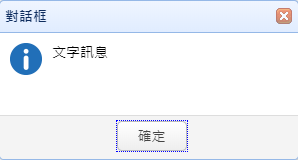
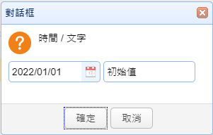

# my.func.js
?>
專案的公共函數

## 工具

### addDebug(str, color)

略

### menuidIsAuth(menuid, callback, \[callback2])

檢查用戶是否有該表單編號的權限

### openWindow(param, callback)

開啟獨佔視窗

### getApi(route, path)

_範例一_

```javascript
// 在 任何地方 呼叫
getApi('get-prdno','bsi010010')
```

> 結果: http://api2.oa-rapid.com/bsi010010/get-prdno

_範例二_

```javascript
// 在 任何地方 呼叫
getApi('get','pub')
```

> 結果: http://api2.oa-rapid.com/pub/get-server-date

### myInputMask(inp, mask)

```javascript
myInputMask(objM.getInput('dt'), '9999/99/99');
```

> 更改Master Data 的 dt 欄位做遮罩

### createDlgImport(opt)

匯入資料的畫面

```javascript
var opt = {
  name: obj.name,
  title: i18nTag('{文字說明}'),
  iconCls: 'icon-excel',
  width: 300,
  height: 200,
  accept: ".xls,.xlsx",
  handler: obj.dlgfunc,
}
dlgUpload = createDlgImport(opt);

//開啟對話框
dlgUpload.open();

//關閉對話框
dlgUpload.close();

//釋放對話框
dlgUpload.destroy();
//如果 繼承FormCtrl6 關閉表單時，會自動釋放

//取得上傳檔案
dlgUpload.getFiles();

//清除上傳檔案
dlgUpload.clear();
```

> 參數說明
>
> * opt - 將所需資訊一次傳入
>   * name - 請放當前表單名稱
>   * title - 彈出畫面的文字敘述
>   * iconCls - 圖示
>   * width - 視窗寬度
>   * height - 視窗高度
>   * accept - 限制所選的檔案副檔名，用逗號隔開
>   * handler - 匯入檔案後所執行的程式
>   * autoFree - 關閉對話框時，自動釋放
>   * multiple - 多個檔案(預設false)

> dlgfunc 創建

```javascript
this.dlgfunc = (e) => {
  const inpFiles =   obj.dlgUpload.find('input[textboxname=file]');
  var files = inpFiles.filebox('files');

  if (!files.length) {
  msgBoxi('{請選擇上傳檔案}')
  return
}
```

### i18nTag(str)

多國語言轉換

```javascript
i18nTag('{蘋果}{書本}')
```

> 本系統多國語言翻譯是以中文字作為ID 參數說明
>
> * str - 輸入要翻譯的文字並用{}包起來做個別翻譯

### openWinReport(params)
略

### openFormById(id, isModal, params)

表單開啟及追隨

```javascript
var menuid = 'bsi020010';
var modal = false;
var qryfld = 'dlvno';
var qryval = 'BQ211109001';
var params = `qryfld=${qryfld}|qryval=${qryval}`;
openFormById(menuid, modal, params);
```

> 參數說明
>
> * menuid - 表單ID
> * modal - 是否用彈出視窗開啟
> * qryfld - 追隨欄位
> * qryval - 搜尋值
> * params - 用 | 整理qryfld,qryval成一個參數

## 對話框


### showProgress(msg, callback)

顯示等候對話框

```javascript
showProgress('{查詢中}', () => {
  //code
})
```

### hideProgress()

關閉等候對話框

```javascript
showProgress('{查詢中}', () => {
  //code
  hideProgress();
})
```

### msgBox(msg)

確認對話框

```javascript
msgBox("文字訊息")
```


### msgBoxi(msg)

確認對話框(帶圖示)

```javascript
msgBoxi("文字訊息")
```



### msgBoxe(msg)

確認對話框(帶錯誤圖示)

```javascript
msgBoxe("文字訊息")
```


### msgBoxw(msg)

確認對話框(帶警告圖示)

```javascript
msgBoxw("文字訊息")
```


### msgBoxq(msg, callback, \[callback2])

確認對話框(帶問號圖示)

```javascript
msgBoxq("文字訊息",
(e) => {
  //code
},
(e) => {
  //code
})
```

> 按 確定 會執行 callback\
> 按 取消 會執行 callback2


### msgBoxy(msg, callback, \[callback2])

```javascript
msgBoxy("文字訊息",
(e) => {
  //code
},
(e) => {
  //code
})
```

> 按 是 會執行 callback\
> 按 否 會執行 callback2


### msgBoxp(msg, opt, callback)

```javascript
var opt = {
  inival: '20220101',
  mask: '9999/99/99',
  editor: 'datebox',
  inival2: '初始值',
  mask2: '',
  editor2: 'textbox',
}
msgBoxp('{時間} / {文字}', opt, (r, r2) => {
//code
})
```

> 參數說明
>
> * opt - 將所需資訊一次傳入
>   * name - 請放當前表單名稱
>   * title - 彈出畫面的文字敘述
>   * iconCls - 圖示



## 訊息


### notice(str, color)

在右上顯示訊息

```javascript
notice('訊息顯示', 'success')
```

> 參數說明
>
> * str - 文字
> * color - 狀態
>   * error
>   * success
>   * warning
>   * notice

### addMessage(str, color)

在下方顯示訊息

```javascript
addMessage('異常顯示', 'warning')
```

> 參數說明
>
> * str - 文字
> * color - 狀態
>   * error
>   * success
>   * warning
>   * notice

### addMsgNotice(str, color)

在右上及下方顯示訊息

```javascript
addMsgNotice('錯誤訊息', 'error')
```

> 參數說明
>
> * str - 文字
> * color - 狀態
>   * error
>   * success
>   * warning
>   * notice

### clearMessage()

清除 下方訊息欄 的文字

## 時間

### getToday()

```javascript
var dt = getToday();
```

> 取得當天日期

### getWeekName(dt)

取得指定日期是星期幾

```javascript
var weekname = getWeekName('20220101')
```

> 結果: 回傳「六」

### dateToStr(date)

時間轉換

```javascript
dateToStr(new Date())
```

> 參數說明
>
> * date - Data物件
>
> 結果: 將Data 物件轉換成我們系統用的時間規則

### strToDate(str)

時間轉換

```javascript
strToDate('20220101')
```

> 參數說明
>
> * str - 我們系統用的時間規則
>
> 結果: 將我們系統用的時間規則轉換成Data 物件

### isDateStr(value)
略

### isYymmStr(value)
略

### setCalendarToday()
略

### getServerCDate(fmt)
略

### getServerTime(fmt)
略

### getServerDate(fmt, act, opts)
略

## ajax

### ajaxUpload(url, uplFile, successCallback, \[errorCallback])

### ajaxPost(url, params, successCallback, \[errorCallback])

用post 去取得資料

```javascript
var url = objM.getApi('cal-next-avgprc','inv');
var params = {
  yymm: '202201'
}

ajaxPost(url, params,
(res) => {
    //code
},
(res) => {
    //code
});
```

> 參數說明
>
> * url - 要Post的位置
> * params - 輸入要傳輸的參數
> * sucessCallback - 當成功取得資料時執行
>   * res - 回傳資料
> * errorCallback - 當取得資料失敗
>   * res - 回傳資料
>   * 注意 res.error = true 跟 res.error.msg 有資料時 會執行

### ajaxGet(url, params, successCallback, \[errorCallback])

用Get 去取得資料

```javascript
var url = objM.getApi('cal-next-avgprc','inv');
var params = {
  yymm: '202201'
}

ajaxGet(url, params,
(res) => {
    //code
}, (res) => {
    //code
});
```

> 參數說明
>
> * url - 要Get的位置
> * params - 輸入要傳輸的參數
> * sucessCallback - 當成功取得資料時執行
>   * res - 回傳資料
> * errorCallback - 當取得資料失敗
>   * res - 回傳資料
>   * 注意 res.error = true 跟 res.error.msg 有資料時 會執行

## 資料傳輸設定

### getDtrnRow(dtrnno, params, successCallback, \[errorCallback])

### getDtrnRows(dtrnno, params, successCallback, \[errorCallback])
