# 報表設計
>[!tip]
報表開發工具

## 報表產生流程

1. 查詢資料 - 依照條件查詢，結果為 Dataset (資料集)，可多個 Dataset
2. 套版 - 將 Dataset 套用到報表樣板，產生報表 (或列印套表)，樣板可以是 .mrt、.xls、.fr3、.doc

## 設計步驟

1. 新增報表編號，輸入其他資料
2. 新增 SQL 語句，儲存
3. 解析參數，設定參數資料
4. 新增樣板，設定樣板資料
5. 解析字典，設定字典欄位標籤
6. 測試

## 設定

### 工具列

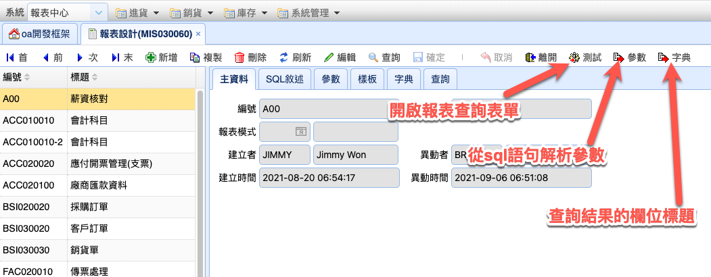

### 主資料

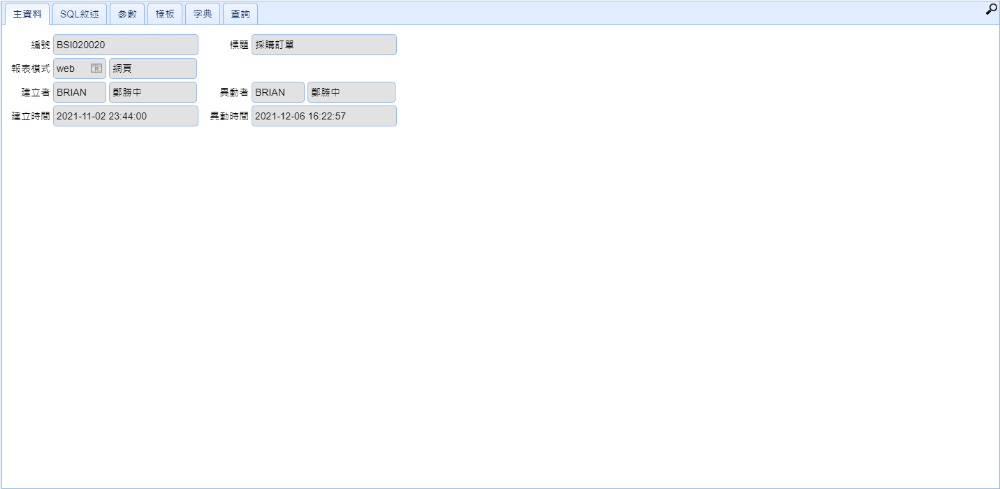

> 說明
>
> * 報表模式
>   * web - web 報表
>   * win - win32 報表

### SQL敘述

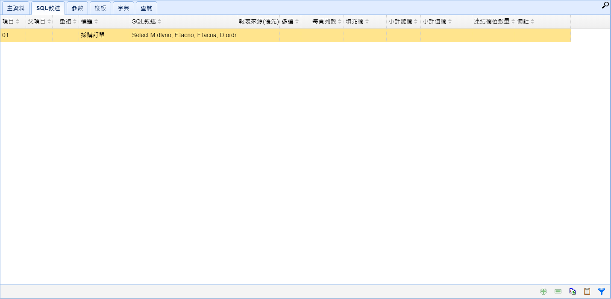

> 說明
>
> * 父項目 - 略
> * 重複 - 略
> * 標題 - 查詢結果頁籤標題
> *   SQL 敘述 - SQL語句
>
>     * 變數 - @+英文字母+數字 範例
>
>     ```sql
>     Select dlvno, prdno, whno
>     From cdd
>     Where whno = @whno
>     ```
> * 報表來源(優先) - PHP 報表
> * 多選 - 略
> * 每頁列數 - 輸入10時，會自動用空白列補足10的倍數(套表用)
> * 填充欄 - 用前面的資料，補齊空白的資料格
>   * 範例 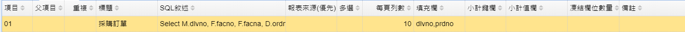
>   * 結果 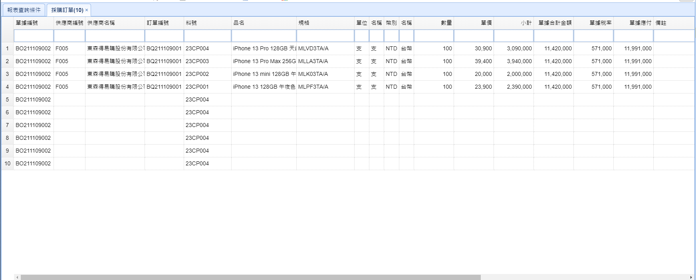
> * 小計鍵欄 - 略
> * 小計鍵值 - 略
> * 凍結欄位數量
> * 備註

### 參數

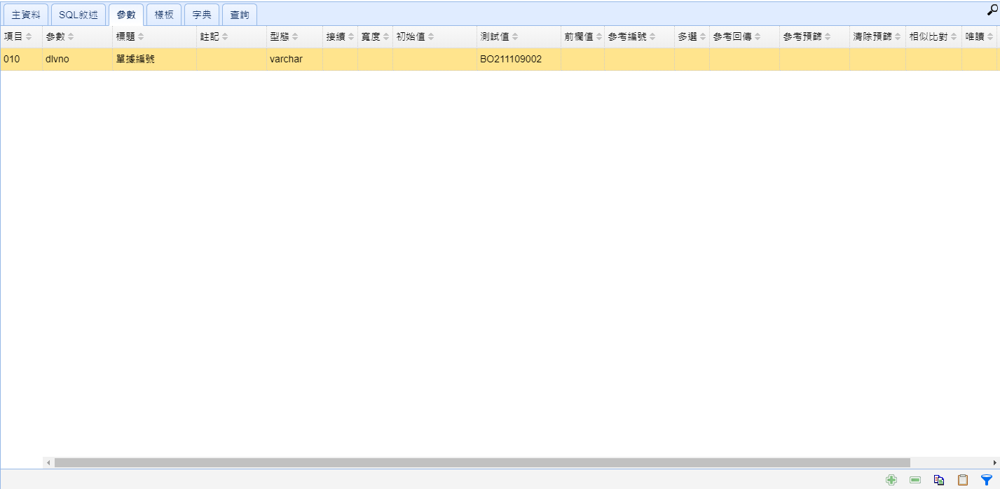

> 說明
>
> * 參數 - 對應 SQL 敘述 裡有 @ 宣告的變數
> * 標題 - 參數標題
> * 註記 - 接在參數標題後
> * 型態 - 變數型態
> * 接續 - 如果是 Y , 就會接在上一個變數後面
>   * 範例 <br> 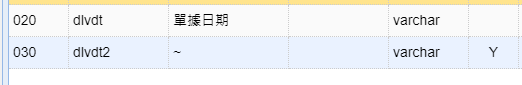
>   * 結果 <br> 
> * 寬度 - 略
> * 初始值 - 查詢條件的初始值
> * 測試值 - 報表設計測試用
> * 前欄值 - 略
> * 多選 - 該欄位為多選，多選的值以「,」分隔
> * 參考編號 - 自動用 參考查詢設計
> * 參考回傳 - 回傳參考查詢結果
>   * 範例 <br> 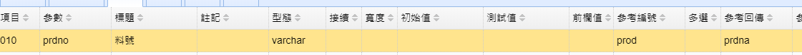
>   * 結果 <br> 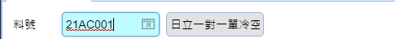
> * 參考預篩 - 略
> * 清除預篩 - 略
> * 相似比對 - sql語句 用 like 時的比對方式(開頭,包含,結尾)
> * 唯讀 - 查詢欄位唯讀
> * 隱藏 - 隱藏查詢欄位
> * 遮罩
>   * 範例 : 9999/99/99 <br> 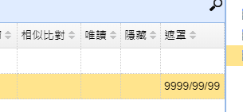
>   * 結果 <br>_圖一_ <br>  <br>_圖二_ <br>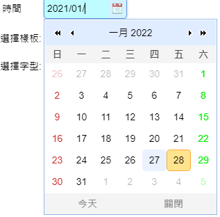

### 樣板

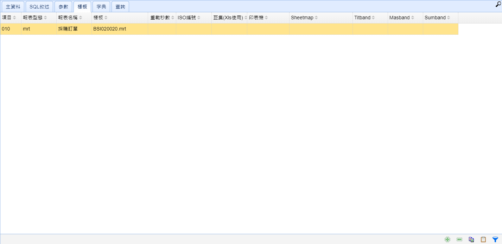

> 說明
>
> * 報表型態
>   * mrt - Web報表
>   * emsxls - Excel 報表
>   * frx - FastReport報表
>   * ardoc - Word 報表
>   * barcode - TSC 標籤機用
> * 報表名稱 - 樣板的報表名稱
> * 樣板 - 檔案名稱
>   * 副檔名要對應各報表型態
> * 重載秒數 - 略
> * ISO編號 - 略
> * 印表機 - win32 直接列印用
> * 巨集(Xls使用) - 呼叫 excel 巨集
> * Sheetmap - excel專用，頁籤對應
> * Titband - excel專用，設定Title Band 範圍
> * Sumband - excel專用，設定Summary 範圍

### 字典

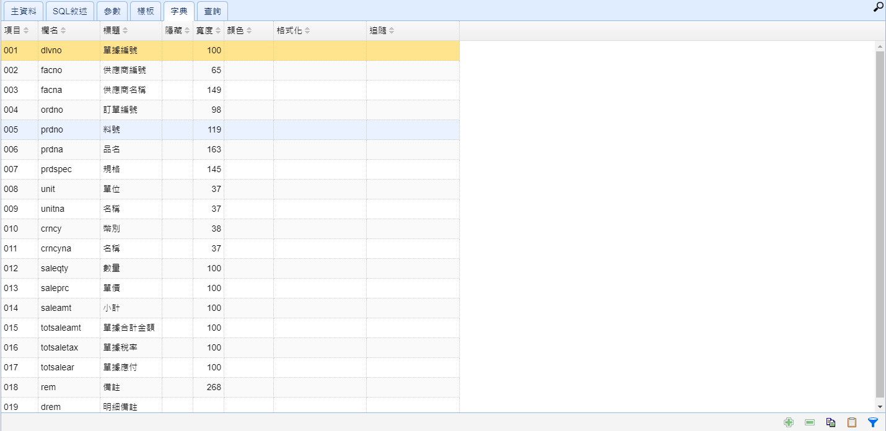

> 說明
>
> * 欄名
> * 標題 - 欄位標題
> * 隱藏 - 隱藏欄位
> * 寬度 - 欄位寬度
> * 顏色 - 欄位字體顏色
> * 格式化
>   * time - 99:99:99
>   * date - 9999/99/99
>   * comma - 千位撇,帶小數位,截掉尾是0
> * 追隨 - 可以雙擊開啟該表單並查詢， 範例: menuid=BSI010015|qryfld=prdno|valfld=prdno
>   * menuid - 表單編號
>   * qryfld - 該表單欄位
>   * valfld - 報表的值

## 報表排版

Band(資料區) 的 排版方式 由裡向外

* Page Header Band - 頁頭 (每頁顯示)
  * Report Title 報表頭 (在第一頁顯示)
    * Header Band - 表頭 (在第一頁顯示,多分頁控制)
      * Group Header Band - 群組頭
        * Data Band - 主資料
      * Group Footer Band - 群組尾
    * Footer Band - 表尾 (在最後一頁顯示,多分頁控制)
  * Report Summary 報表尾 (在最後一頁顯示)
* Page Footer Band - 頁尾 (每頁顯示)

> 範例

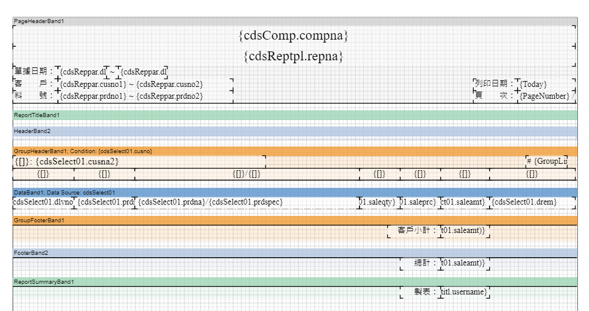

> 結果

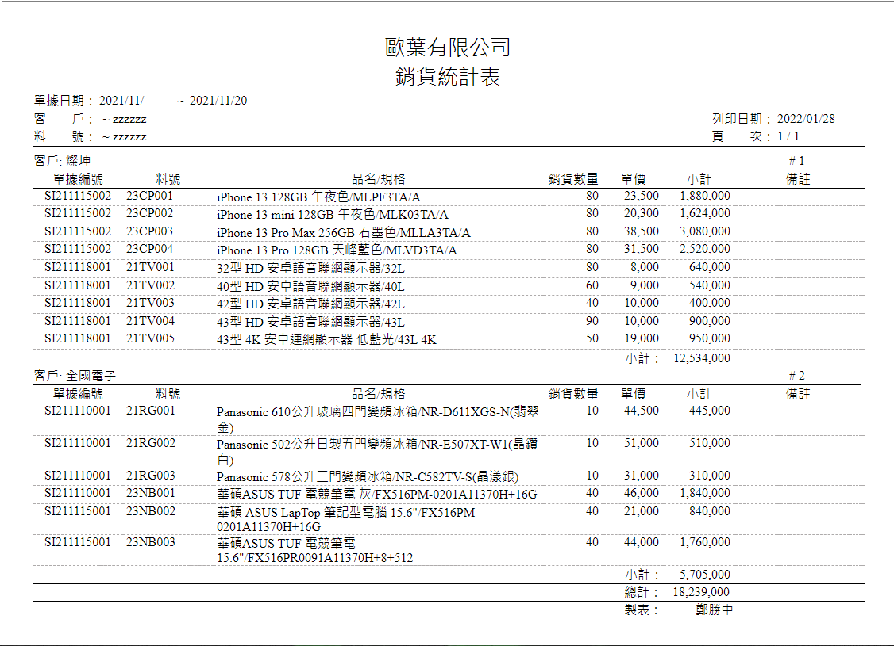

## 報表種類

### mrt

Web 報表 排版方式參考 報表排版

> 設定範例

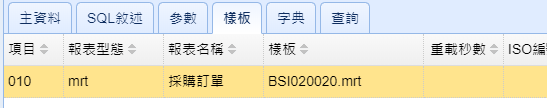

> 資料範例

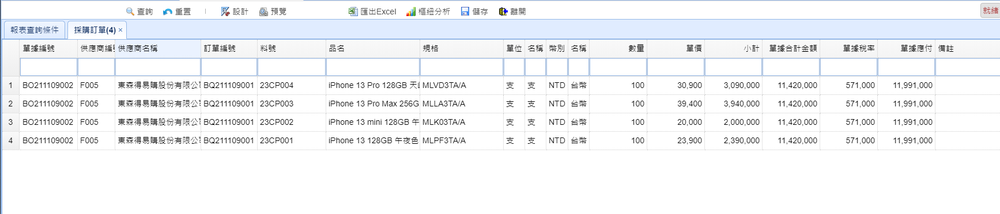

> 畫面設計 - 在查完資料後按工具列設計

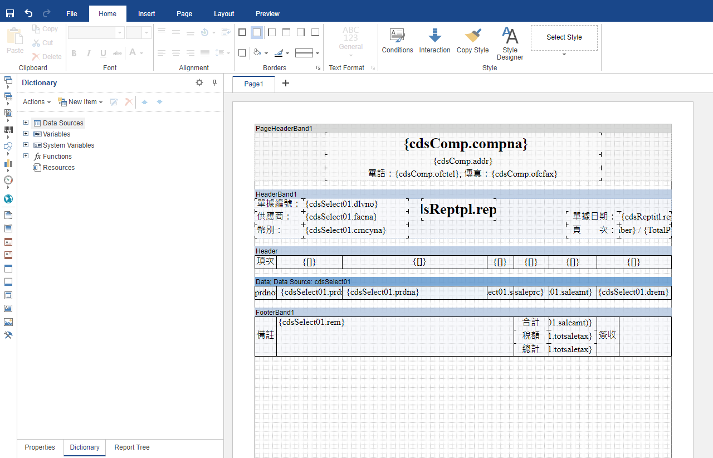

### emsxls

Excel 報表 (win32)

> 報表設計 參數設定

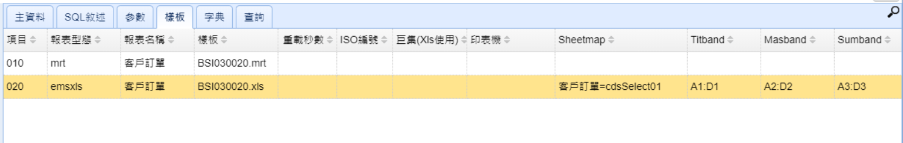

> 參數說明
>
> * 巨集 -
> * Sheetmap - 設定資料對應excel的表單 格式: excel表單名稱=cdsSelect01 cdsSelect01 是指SQL敘述裡第1筆抓出來的資料
> * Titband - 標題列表的範圍
> * Masband - 資料表的範圍
> * Sumband - 設定 sum 的範圍

> 設計工具

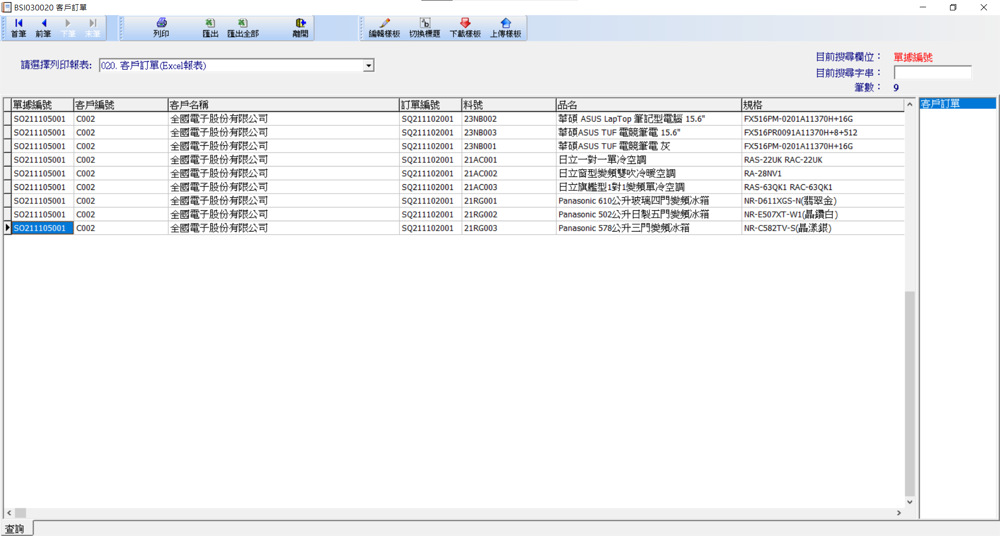

> 按鈕說明
>
> * 編輯樣板 開啟一個設計畫面， <br>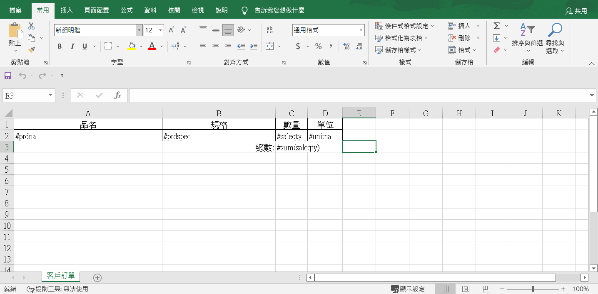
> * 切換標題 - 查看欄名的參數
> * 下載樣板 - 從 server 下載樣板
> * 上傳樣板 - 將樣板上傳 server
> * 列印 <br>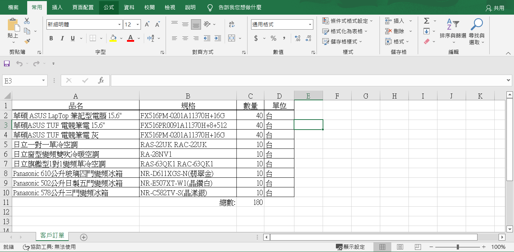

### frx

frx 報表 (win32) 排版方式參考 報表排版 呼叫 Windows 列印功能，可預覽 或 直接列印 或 套表

> 參數設定

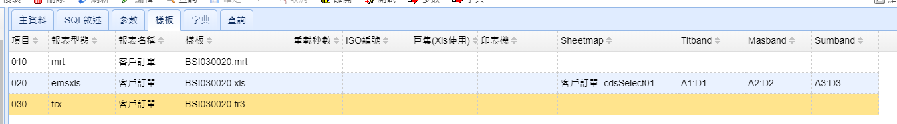

> 工具

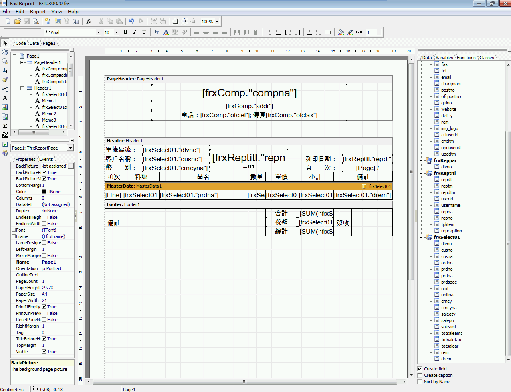

### ardoc

Word 報表 (win32)

### barcode

標籤機 (win32) 呼叫TSC 的 .dll
