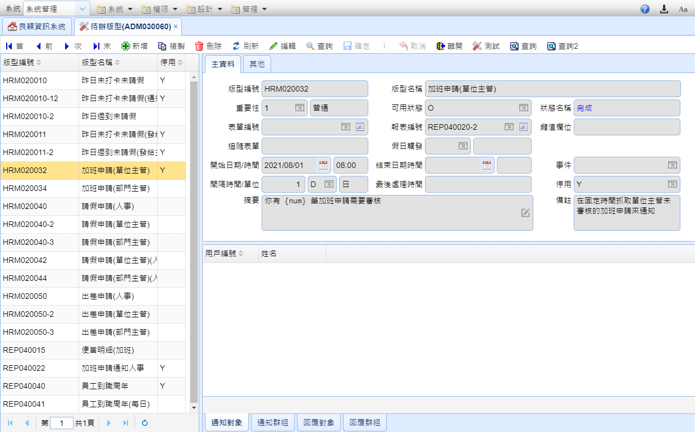
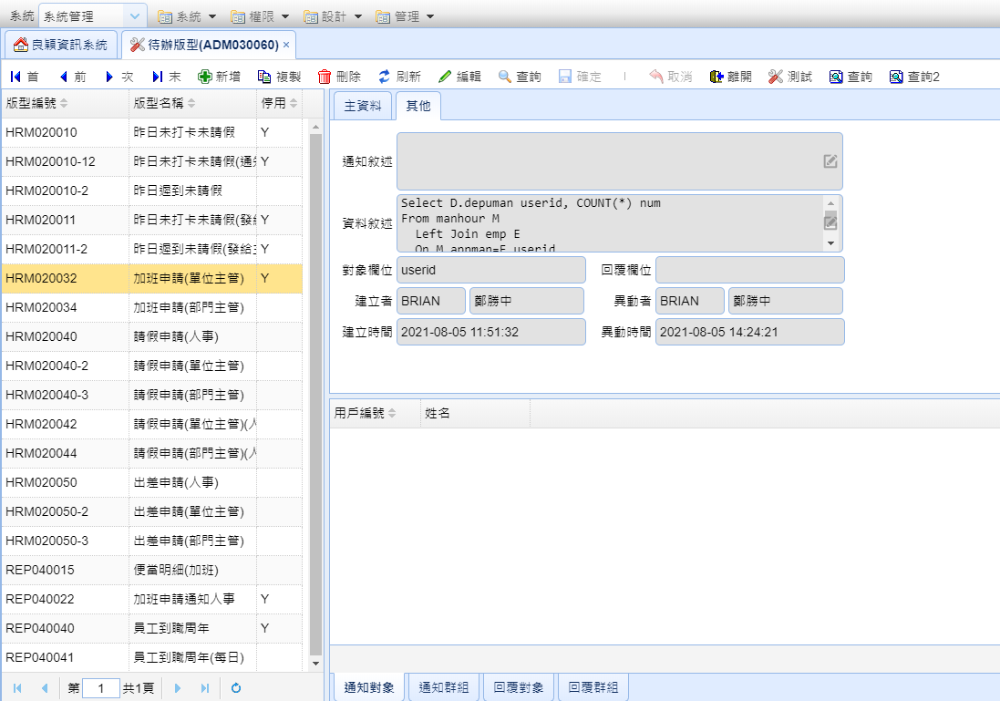
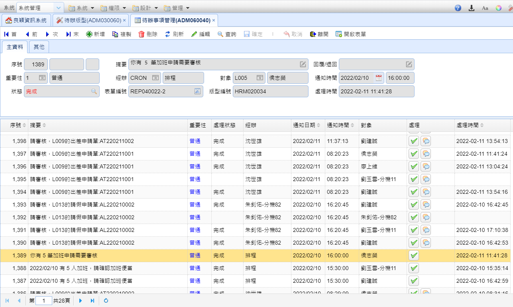
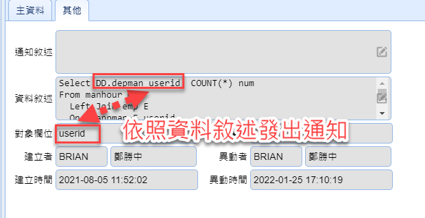

# 待辦設計
?>
個人的待辦事項，可開啟待辦表單

## 待辦的觸發分類

* 定時觸發 - 用報表的查詢結果
* 表單觸發 - 用戶確定存擋時

## 設定畫面

 

## 通知畫面

個人只能查看自己的待辦，管理者可以查看全部

## Master Edit

### 主資料

#### 版型編號

待辦版型的編號

#### 版型名稱

待辦版型的名稱

#### 重要性

待辦的重要性

> 參數
>
> * 1 - 普通
> * 2 - 中等
> * 3 - 重要

#### 可用狀態

收到待辦通知時可操作的動作

> 參數
>
> * F - 回覆
>   * 回覆發送者&#x20;
>   * 依照 Detail Grid 設定的"回覆對象"跟"回覆群組"
> * H - 處理中
> * O - 完成
> * R - 退回 說明
> * 多個狀態時用逗號分隔&#x20;
>
> 範例 : O,F&#x20;
>
> 結果 : 可以完成或回覆

#### 表單編號

要觸發的表單

#### 報表編號

要觸發的報表來源

#### 鍵值欄位

鍵值欄位

#### 追隨表單

讓接收者要開啟的表單

#### 假日觸發

假日是否要觸發

#### 開始日期/時間

什麼時候開始啟用此待辦

#### 結束日期/時間

甚麼時候結束此待辦

#### 事件

當有設定表單編號時使用 依照條件觸發待辦

> 參數&#x20;
>
> * afterPost - 當表單單據儲存後

#### 間隔時間/單位

觸發待辦的時間間隔

#### 最後處理時間

略

#### 停用

停用此待辦

#### 摘要

待辦的內容

> 可以使用Master Edit -> 其他分頁 的資料敘述的抓取的資料
>
> 欄位名稱需用{}框起來
>
> 範例:
>
> 請審核，{appman}的請假申請單:{mahno}

#### 備註

說明待辦的功能

### 其他

#### 通知敘述

略

#### 資料敘述

SQL語句

#### 對象欄位

依照資料敘述發出通知

> 範例   

#### 回覆欄位

略

## Detail Grid

#### 通知對象

通知對象的編號/帳號

#### 通知群組

設定通知的群組

#### 回覆對象

在使用者回覆時通知的對象編號/帳號

#### 回覆群組

在使用者回覆時通知的群組
